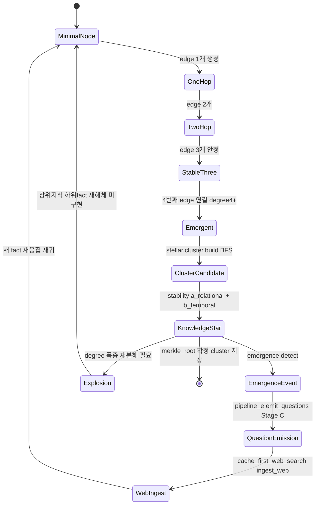
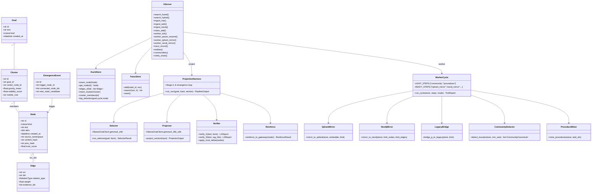
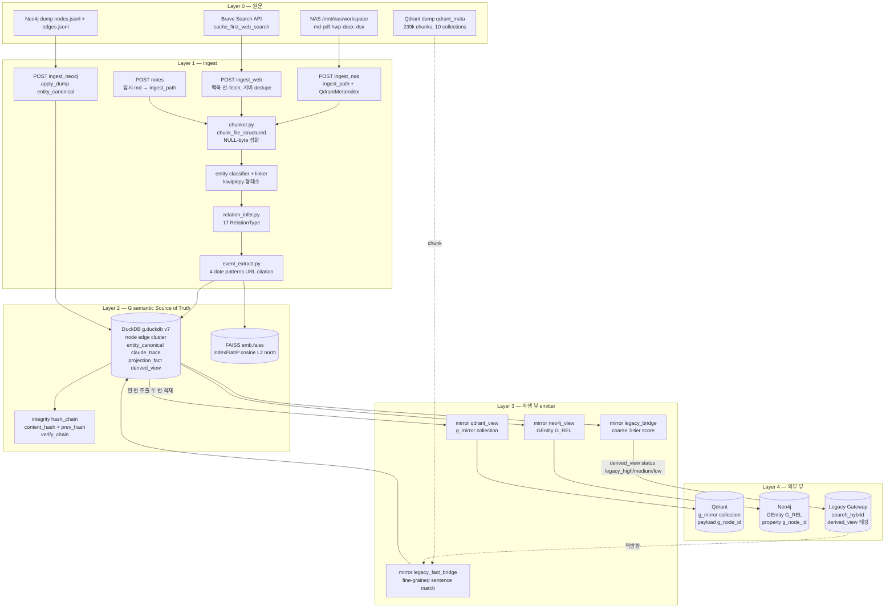
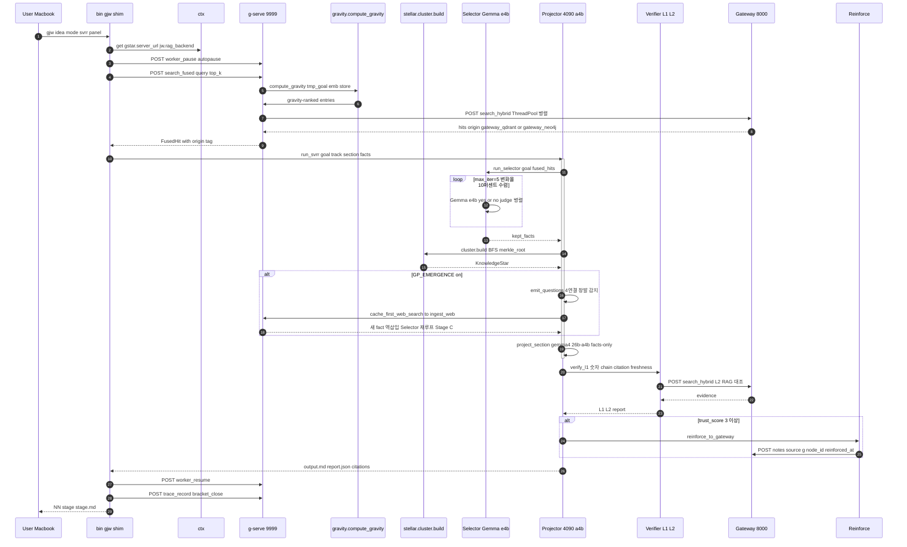
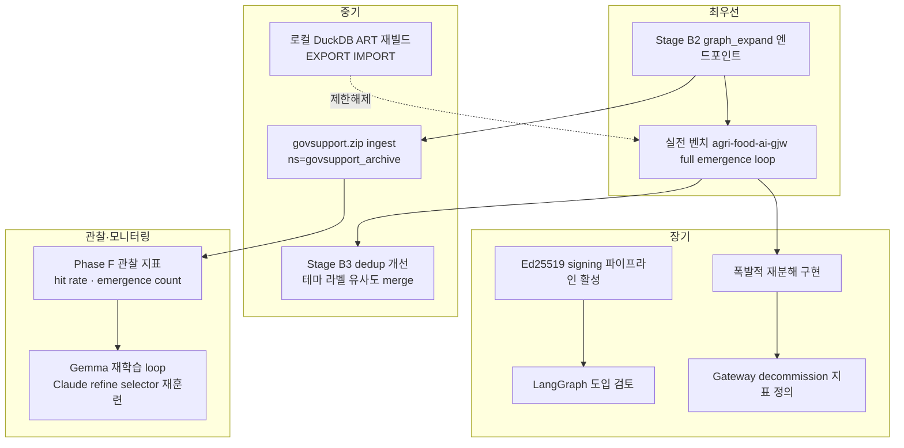

# G-System — 통합 설계·운영·유지보수 문서

> **대상 레포**: `~/workspace/local-claude` (루트 60+ 커밋, 최신 `0d1f7a6`, 2026-04-22 기준)
> **문서 성격**: 설계 + 운영 + 개발자 가이드 + 개념 백서 + 유지보수 문서를 겸한 *living document*.
> **기준**: README·memory·커밋 메시지가 서로 다를 때 **실제 코드·설정·배포 상태 우선**. 본 문서는 `src/gstar/`, `deploy/gserve/`, `bin/`, `docs/worker-ops.md` 를 1차 근거로 작성됐다.

---

## 목차

1. [문제 배경](#1-문제-배경)
2. [목표와 설계 원칙](#2-목표와-설계-원칙)
3. [핵심 철학과 개념 모델 — A ~ G](#3-핵심-철학과-개념-모델--a--g)
4. [전체 아키텍처](#4-전체-아키텍처)
5. [데이터 및 지식 흐름](#5-데이터-및-지식-흐름)
6. [현재 구현 상태 요약](#6-현재-구현-상태-요약)
7. [구현 구조](#7-구현-구조)
8. [운영 방식](#8-운영-방식)
9. [유지보수와 변경 관리](#9-유지보수와-변경-관리)
10. [한계와 트레이드오프](#10-한계와-트레이드오프)
11. [확장 로드맵](#11-확장-로드맵)
12. [완전 API 레퍼런스](#12-완전-api-레퍼런스)
13. [Architecture Decision Records (ADR)](#13-architecture-decision-records-adr)
14. [상세 운영 런북](#14-상세-운영-런북)
15. [부록 — 운영 체크리스트 · 온보딩 · 장애 대응 · 사실 vs 목표 요약](#15-부록)

---

## 1. 문제 배경

### 1.1 왜 이 시스템이 필요한가

일반 RAG는 **chunk + embedding similarity** 기반이다. 이 구조에서는:

- 의미는 있지만 **관계**가 없다 — "트럭"이 어떤 entity에 종속된 건지 모른다.
- **시간·상황·근거**가 payload에 엉성하게 들어간다 — 검증이 어렵다.
- 같은 chunk가 Qdrant/Neo4j에 중복 적재 — **"한 번 추출, 두 번 적재"**가 아닌 "**두 번 추출, 두 번 적재**"가 되어 버린다.
- 사용자 목표(goal)가 바뀌면 재랭킹만 가능하고 **지식 자체를 재응집**시키지 못한다.

Gemma 4 e4b 4-bit로 사업계획서를 생성했을 때 품질이 떨어진 실측 경험이 trigger였다. 원인은 **모델 크기**가 아니라 **모델이 다루는 지식 단위의 파편화**였다. G는 이 단위를 재설계한다.

### 1.2 기존 RAG와 G의 관계 (공존 전제)

> **절대 대체 관계가 아니다.** 기존 Gateway(Qdrant + Neo4j)는 **정적 신뢰 기반**으로 유지되고, G는 그 위에 얹히는 **동적 응집/창발 계층**이다. 현재 단계는 "G가 상위, 기존 RAG가 하위 신뢰 기반"의 상호보완 구조.

```
┌──────────────────────────────────────────────────────────┐
│                      사용자 / Claude Code                 │
└────────────────────────────┬─────────────────────────────┘
                             │  (goal, query)
                             ▼
           ┌──────────────────────────────────┐
           │  G 상위 응집 계층 (9999)          │
           │    /search/fused — 통합 wrapper   │ ◀── **우선 호출**
           └──┬────────────────────────┬──────┘
              │                        │
              │ gravity + stellar       │ fallback / verify
              │ (동적 응집·창발)         │
              ▼                        ▼
   ┌────────────────┐       ┌─────────────────────┐
   │ G DuckDB +     │       │  Legacy Gateway      │
   │ FAISS          │◀─────▶│  (:8000) — 정적 신뢰   │
   │ (semantic SoT) │ mirror│  Qdrant + Neo4j      │
   └────────────────┘       └─────────────────────┘
         ▲                           ▲
         │ mirror/{qdrant,neo4j}_view │ legacy_bridge·legacy_fact_bridge
         │ "한 번 추출 두 번 적재"       │ (역방향 fine-grained 매칭)
         └───────────────────────────┘
```

### 1.3 실무적으로 중요한 포인트
- `http://100.79.251.53:9999/search/fused` 가 **기본 진입점**이며 기존 `:8000/search/hybrid` 는 이 wrapper 내부에서 병렬 호출된다.
- G와 Gateway는 **동시 운용**. Gateway decommission은 **금지**(장기 관찰 후 축소만).
- Fused 결과에는 `origin ∈ {g, gateway_qdrant, gateway_neo4j}` provenance 태그가 붙어 어디서 온 정보인지 추적 가능.

---

## 2. 목표와 설계 원칙

### 2.1 일곱 가지 원칙 (코드 레벨 불변)

| # | 원칙 | 코드 표현 |
|---|------|-----------|
| 1 | **한 번 추출, 두 번 적재** | `mirror/qdrant_view.py` · `mirror/neo4j_view.py` — G → 파생 뷰 emit |
| 2 | **원본 → 정규화 → 파생 뷰 3단계** | NAS `/nas/workspace` → G(DuckDB) → Qdrant `g_mirror` / Neo4j `GEntity` |
| 3 | **G가 semantic Source-of-Truth** | `derived_view` 테이블 + `g_node_id` anchor |
| 4 | **Qdrant = 검색 뷰, Neo4j = 관계 뷰** | 파생 뷰는 언제든 재생성 가능. 독자 상태 없음. |
| 5 | **Chunk 직접 저장 금지 → fact/entity/edge 상향 추상화** | `schema.Node.kind ∈ {fact, entity, relation, event, state, evidence, procedure, document, section}` |
| 6 | **Fine-grained evidence는 보조 계층** | `legacy_fact_bridge` 가 chunk ↔ G fact를 문장 단위로 매칭 |
| 7 | **Provenance anchor = `g_node_id`** | Qdrant payload, Neo4j property 모두 동일 키 사용 |

### 2.2 운영 원칙

- **Single writer**: DuckDB 특성상 `uvicorn --workers 1` 강제 (`deploy/gserve/Dockerfile`).
- **Network mode host**: NordVPN/Docker iptables 충돌 회피 (`deploy/gserve/docker-compose.yml`).
- **Pause/Resume**: 장시간 작업 중 worker는 자동 pause (`bin/jw-shim`, `re-shim`).
- **Immutable chain**: 모든 node에 `content_hash` + 같은 namespace 내 `prev_hash`. 변조 시 `verify chain` 이 깨진 node id를 반환.
- **Namespace = 프로젝트/회사 경계**: 이직·공유 대비 `g provenance set-ns <name>` 으로 전환.

### 2.3 실무적으로 중요한 포인트
- 원칙 1~4는 `mirror/*` 모듈이 전부 담당한다. 새 파생 뷰를 추가하려면 `mirror/<name>_view.py` + `derived_view.view` 새 값만 추가하면 된다.
- 원칙 7 덕분에 Qdrant/Neo4j 어디서 검색하든 `g_node_id` 로 G로 되돌아올 수 있다 — 검증과 재응집의 핵심 열쇠.

---

## 3. 핵심 철학과 개념 모델 — A ~ G

### 3.1 A~G 요약

| 기호 | 개념 | 실제 코드 대응 |
|------|------|------------------|
| **A** | 의미+관계+시간/상황+근거를 함께 담는 entity-centric knowledge object | `schema.Node(kind='entity')` + `entity/classifier.py`·`linker.py`·`graph.py` |
| **B** | 시간·무결성·정합성·상태전이·검증 가능성을 포함하는 stateful knowledge | `integrity/hash_chain.py`·`merkle.py` + `node.trust_score`·`verification_log` (Storage v5) |
| **C** | 사업계획서/코딩/연구는 **동일 기반 위의 표현 형식** | `projection/tasks/{proposal,research,coding,document}.py` (TaskDefinition ABC) + `Track` enum |
| **D** | Gemma는 깊은 이해 엔진이 아니라 **병렬 선택 엔진** (selector/router/scorer) | `projection/selector_loop.py` + `selector/gemma_client.OllamaChatClient` (e4b yes/no judge) |
| **E** | 목표 중심 **중력장**에서 정보가 응집되는 gravity 기반 지식 응집 구조 | `gravity/field.compute_gravity` + `gravity/score.py` 6성분 가중합 |
| **F** | 자연어는 의미 언어, LangGraph류는 **선택/전이 조직 언어** | `projection/pipeline_e.run_svrr` (Selector → Projector → Verifier → Reinforce 상태머신) |
| **G** | 지식 항성 모델: 최소 정보 노드 + 중력 응집 + A/B 안정화 + **3연결 안정 / 4연결 창발 / 폭발적 재분해** | `stellar/{cluster,stability,emergence,gap_analysis}.py` + `schema.EmergenceEvent` |

### 3.2 지식 항성 형성 — 상태 다이어그램



> **Stage C (창발 루프)는 실제 동작**. `GP_EMERGENCE=on GP_EMERGENCE_TOP_K=40 GP_EMERGENCE_CANDIDATE_K=160` 로 활성화. 2026-04-22 "트럭 지식항성" 실제 형성 관측 (commits `3ed9633 → d66fda5 → 0d1f7a6`). 폭발적 재분해는 **미구현**.

### 3.3 C의 의미 — 단일 프레임, 4 트랙 진입점

```
            ┌────────────── Track (Type: proposal|research|coding|document) ──────────┐
            │                                                                          │
            ▼                                                                          ▼
        g project run <track> <stage>        bin/gjw · gre · gcode · gdoc
                                                      │
                            ┌──────────────────┬──────┴───────┬────────────────┐
                            │                  │              │                │
                           gjw                gre           gcode             gdoc
                        (proposal)         (research)      (coding)        (document)
                        12 stage           12 stage        5 stage         4 stage
                    idea→…→final-doc   idea→…→lab-note   explore→review   outline→finalize
```

4 트랙은 동일 `TaskDefinition` ABC (`projection/tasks/base.py`) 를 구현한 **플러그인**. 사업계획서, 연구 프로젝트, 코드 플래닝, 기술 문서 모두 "의미와 관계를 구조화하는 같은 기반의 다른 표현 형식"이라는 C 원칙이 4 track 통일로 구현되었다.

### 3.4 실무적으로 중요한 포인트
- A/B는 `Node` schema + `integrity/*` 에 이미 녹아있다 — 새 module에 `content_hash` 계산을 다시 쓰지 마라, `hash_chain.compute_content_hash()` 를 호출해라.
- E(중력장)와 G(항성)는 분리된 모듈이다. gravity는 *랭킹*, stellar는 *구조화*. 둘을 같은 함수에 섞지 마라.
- D 원칙 덕분에 Gemma e4b (selector)의 역할은 **yes/no 판정**에 한정된다. 판정 로직 확장은 projector(a4b) 쪽에 넣어야 한다.

---

## 4. 전체 아키텍처

### 4.1 물리 토폴로지 (ASCII)

```
╔══════════════════════════════════════════════════════════════════════════════╗
║                              물리 배치 (4-Tier)                               ║
╠══════════════════════════════════════════════════════════════════════════════╣
║                                                                              ║
║  ┌─────────────────┐           Meshnet (nordlynx)                           ║
║  │  맥북 (home/     │  ────────────────────────────────────────┐             ║
║  │   office/offline)│                                          │             ║
║  │ Apple Silicon    │  SwiftBar · ctx · bin/gjw·gre·gcode·gdoc│             ║
║  │ macOS 15 Sequoia │  ~/.ctx/  ~/.gstar/  ~/.gstar-mirror/   │             ║
║  │ ljw5G 홈 WiFi    │                                          │             ║
║  │ Ollama :11434    │  Gemma4 e4b (Selector, yes/no judge)    │             ║
║  └─────────────────┘                                          │             ║
║                                                               │             ║
║  ┌─────────────────┐                                          │             ║
║  │  4090 인퍼런스    │ 100.105.221.243:11434 (Ollama)          │             ║
║  │  서버            │  Gemma4 26b-a4b-it-q4_K_M (Projector)    │             ║
║  │                 │  GP_OLLAMA_HOST / PROJECTOR_MODEL        │             ║
║  └─────────────────┘                                          │             ║
║           ▲                                                   │             ║
║           │ HTTP (Ollama API)                                 │             ║
║           │                                                   ▼             ║
║  ┌───────────────────────────────────────────────────────────────────────┐ ║
║  │  미니 PC  ljw-op (100.79.251.53, Ubuntu 24.04 x86, Docker 29.4)        │ ║
║  │                                                                        │ ║
║  │  ┌─────────────────┐  ┌──────────────────┐  ┌────────────────────┐   │ ║
║  │  │ g-serve :9999   │  │ Legacy Gateway   │  │ MCP: qdrant/neo4j/ │   │ ║
║  │  │ (uvicorn x1)    │  │ :8000 (기존 RAG) │  │ jw/re/doc          │   │ ║
║  │  │  + worker tick  │  │  Qdrant:6333     │  │ mcp-g-trace :8767  │   │ ║
║  │  │                 │  │  Neo4j:7687      │  │                    │   │ ║
║  │  └─────────────────┘  └──────────────────┘  └────────────────────┘   │ ║
║  │         │                     ▲                                      │ ║
║  │         │ bind mount          │  /search/hybrid · /graph/query       │ ║
║  │         ▼                     │  X-Auth-Token                         │ ║
║  │  /app/state  ←─  /home/ljw-op/gstar-data  (로컬 SSD, 42k+ nodes)     │ ║
║  │    g.duckdb, emb.faiss, *.cursor, worker.paused                       │ ║
║  │                                                                        │ ║
║  │  /nas/workspace (ro) ← host /mnt/nas/workspace (CIFS autofs)          │ ║
║  │    /_inbox/govsupport_archive/govsupport.zip (89GB, 미ingest)          │ ║
║  │    /code_repos (13k files, 점진 이관 중)                                │ ║
║  │    /projects/, /articles/, /meeting_notes/, /personal_notes/           │ ║
║  └───────────────────────────────────────────────────────────────────────┘ ║
║           │                                                                 ║
║           │ SMB (CIFS)                                                      ║
║           ▼                                                                 ║
║  ┌─────────────────┐                                                       ║
║  │  NAS  DS218      │  192.168.0.4  (원문 저장소, 연산 없음)                ║
║  │  /volume1/       │  CIFS export `workspace`                              ║
║  │    workspace/    │  DSM Hyper Backup (옵션, 현재 Dropbox 우선)          ║
║  └─────────────────┘                                                       ║
║                                                                              ║
║  ┌─────────────────┐           ┌──────────────────┐                        ║
║  │ Dropbox          │ ◀─ rsync │  launchd agent    │                        ║
║  │ gstar-backups/   │  daily   │  (맥북)          │                        ║
║  │  archives/       │  03:00   │                  │                        ║
║  │  anchors/        │          └──────────────────┘                        ║
║  └─────────────────┘                                                       ║
║                                                                              ║
╚══════════════════════════════════════════════════════════════════════════════╝
```

### 4.2 논리 아키텍처 (ASCII 계층)

```
┌──────────────────────────────────────────────────────────────────────────┐
│ Layer 5 — UX                                                              │
│   bin/gjw · gre · gcode · gdoc   │   bin/jw-shim · re-shim  (legacy)     │
│   g project run <track> <stage>   │   /p-refine skill · g-trace skill    │
│   SwiftBar (ctx 표시)              │   Claude Code Stop hook (g-session-push) │
├──────────────────────────────────────────────────────────────────────────┤
│ Layer 4 — Projection Harness (P축)                                        │
│   pipeline_e.run_svrr ──┬─► Selector (e4b) ──► Projector (4090 26b-a4b) │
│                         │                                                │
│                         ├─► Verifier L1(rule) + L2(RAG 대조)             │
│                         └─► Reinforce (trust≥3 → Gateway /notes 역축적)   │
│   Stage A–E (emergence loop, GP_EMERGENCE=on)                             │
├──────────────────────────────────────────────────────────────────────────┤
│ Layer 3 — G 응집 계층 (semantic Source-of-Truth)                          │
│   /search/fused (G + Gateway 병렬)    /notes (+Qdrant mirror opt-in)      │
│   /search/hybrid (G only)             /trace/* (Claude bracketed trace)    │
│   gravity · stellar · emergence        entity · integrity · verify        │
├──────────────────────────────────────────────────────────────────────────┤
│ Layer 2 — 정규화 · 파생 뷰                                                 │
│   ingest/pipeline.ingest_path         mirror/qdrant_view (g_mirror)       │
│   entity/classifier · linker          mirror/neo4j_view (GEntity/G_REL)   │
│   ingest/{event,relation}_extract     mirror/legacy_{bridge,fact_bridge}  │
│   ingest/qdrant_meta (메타 주입)                                           │
├──────────────────────────────────────────────────────────────────────────┤
│ Layer 1 — 저장소                                                           │
│   DuckDB (g.duckdb, v7)               FAISS (emb.faiss, IndexFlatIP)      │
│   node/edge/goal/cluster/namespace    entity_canonical/alias/relation_type│
│   worker_tick/claude_trace            projection_fact/run/summary         │
│   community_canonical/derived_view    verification_log                    │
├──────────────────────────────────────────────────────────────────────────┤
│ Layer 0 — 원문                                                            │
│   NAS /mnt/nas/workspace (CIFS, ro)   Qdrant 239k chunks (legacy dump)    │
│   code_repos/ 13k files               Neo4j 219 nodes (graph_import)      │
│   govsupport.zip 89GB (미ingest)                                           │
└──────────────────────────────────────────────────────────────────────────┘
```

### 4.3 클래스 다이어그램 (핵심 컴포넌트)



### 4.4 실무적으로 중요한 포인트
- **미니 PC = 운영 게이트 + 정규화 엔진**이다. g-serve, worker tick, legacy Gateway(8000), Qdrant, Neo4j가 전부 여기서 돈다. 이 장비가 죽으면 시스템 전체가 마비된다.
- **4090은 projector 전용**이다. Selector(e4b)는 맥북 또는 4090 어느 쪽에 올려도 되지만 기본은 맥북. `OLLAMA_HOST` 와 `GP_OLLAMA_HOST` 는 분리된 env라는 점 유의.
- **NAS는 원문 저장소 역할만**. 연산·DB는 절대 NAS 위에 올리지 마라 (DuckDB over SMB 락 불안정).
- `/home/ljw-op/gstar-data` (미니 PC 로컬 SSD)가 G의 **master**. 맥북 `~/.gstar/state/` 는 frozen archive이고 현재 ART 인덱스 손상 상태라서 `GP_LOCAL_RETRIEVAL=off` 로 우회 중.

---

## 5. 데이터 및 지식 흐름

### 5.1 Ingest → 정규화 → 파생 뷰 (Mermaid flowchart)



### 5.2 사용자 요청 → 지식 항성 형성 → 투영 → 검증 (Sequence Diagram)



### 5.3 운영 모드 전환 (맥북 위치별)

```
┌──────────────────────────────────────────────────────────────┐
│               맥북 위치 기반 운영 모드                          │
├──────────────────────────────────────────────────────────────┤
│                                                              │
│   [집 LAN (ljw5G)]                                           │
│        │                                                     │
│        ▼                                                     │
│   ctx switch home ──► Meshnet direct peer (192.168.0.x)     │
│        │                                                     │
│        ▼                                                     │
│   namespace=personal  gateway_mode=meshnet-direct             │
│   gstar.server_url=http://100.79.251.53:9999                 │
│   품질: 지연 < 50ms, TCP 안정                                  │
│                                                              │
│   ──────────────────────────────────────────                 │
│                                                              │
│   [외부 네트워크 (회사·카페)]                                   │
│        │                                                     │
│        ▼                                                     │
│   ctx autodetect --apply → office-daegyeom                  │
│        │                                                     │
│        ▼                                                     │
│   Meshnet NAT 관통 시도 → TCP drop 빈번                        │
│        │                                                     │
│        ▼                                                     │
│   SSH 터널 fallback (port 22, 표준 방화벽 통과)                │
│        ssh -fN -L 8000:100.79.251.53:8000 \                 │
│                -L 9999:100.79.251.53:9999 ljw-op             │
│        │                                                     │
│        ▼                                                     │
│   URL → localhost:9999 / localhost:8000 로 치환                │
│   품질: 지연 80-150ms (SSH 오버헤드)                            │
│                                                              │
│   ──────────────────────────────────────────                 │
│                                                              │
│   [오프라인 (비행기·철도)]                                     │
│        │                                                     │
│        ▼                                                     │
│   ctx switch offline                                         │
│        │                                                     │
│        ▼                                                     │
│   jw.rag_enabled=false  gateway_mode=disabled                │
│   GSTAR_SERVER_URL=""   GP_WEB_REMOTE=off                    │
│        │                                                     │
│        ▼                                                     │
│   로컬 DuckDB 사용 (단 ART 인덱스 손상으로 READ-ONLY 권장)        │
│   실제: GP_LOCAL_RETRIEVAL=off → store=None 로 svrr 경량 운영   │
│                                                              │
└──────────────────────────────────────────────────────────────┘
```

### 5.4 실무적으로 중요한 포인트
- `/ingest/web` 은 **맥북이 fetch 완료된 content를 던진다**. 서버 측 fetch 없음 → 네트워크 오버헤드 1회로 끝나고 Claude WebFetch 안정성을 재활용.
- 역방향 `legacy_fact_bridge` 는 **chunk를 문장 단위로 쪼개 G fact에 매칭**한다. legacy granularity 불일치 해결의 핵심. `per_tick` 50-200 유지.
- L2 검증은 항상 **Gateway `/search/hybrid`** 로 돈다. G 자기 자신으로 검증하지 않는다 — 정적 신뢰 기반이 안전망이라는 설계 원칙.

---

## 6. 현재 구현 상태 요약

### 6.1 Phase 진척 매트릭스 (커밋 연동)

| Phase | 상태 | 핵심 커밋 | 비고 |
|-------|------|-----------|------|
| **Initial** (Week 1~6) | ✅ | `20fb6db` | Storage v1·Ingest·Gravity·Integrity·Selector·Stellar |
| **Phase 7.1~7.6** (배포 + 자동화) | ✅ | 배포 완료 | `ctx`, g-serve, Dropbox 백업, jw-shim/re-shim |
| **Phase 7.5 P축** (엔티티+투영 프레임워크) | ✅ | `1781d3f` → `1f6083c` → `24d0e48` 등 | 439/439 tests PASS |
| **Enrich (12 백엔드 + Web→G cache)** | ✅ | `84c00db` → `0749afe` | ddg/brave/tavily/exa/searchapi/serpapi/perplexity/you/naver/google/self_made/mock |
| **A1+A2 NAS ingest + Qdrant meta 주입** | ✅ | `9c1ef71` | `/ingest/nas` + `QdrantMetaIndex` |
| **A3+A4 Neo4j→G + 검증** | ✅ | `8615f06` | 219 Neo4j nodes → 219 entity, 165 edges |
| **B1+B2 worker + Louvain + pause/resume** | ✅ | `b427a65` | 10 communities / 142 members |
| **C1 jw/re shim hook** | ✅ | `cb8a596` | GP_AUTOPAUSE 토글 |
| **D1 /notes + D2 /search/fused + D3 client** | ✅ | `cb8a596` | origin 태그 3종 |
| **E1~E4 Selector/Projector/Verifier/Reinforce + svrr 파이프라인** | ✅ | `683e7a0` | `classic/sv/svr/svrr` 4 모드 |
| **G1~G7 trace + MCP + procedure miner** | ✅ | `25994c0`·`bdeb276`·`c9ac4d9` | port 8767 healthy |
| **H1~H10 3단계 아키텍처 + tick step 분리** | ✅ | `e33a0cf` → `77ab005` | Storage v7, derived_view + 5 개별 endpoints |
| **Stage P-Q1+P-Q2 양식 질문 트리 기반 per-question svrr** | ✅ | `33c27d7` | |
| **Stage B(3) 실시간 테마 그룹핑** | ✅ | `a542d9c`·`0d1f7a6` | GP_THEME_GROUP=on + chunk 분할 |
| **Stage C 창발 질문 유출 + 재귀 웹→G 루프** | ✅ | `3ed9633`·`d66fda5`·`0d1f7a6` | GP_EMERGENCE=on, 실측 "트럭 지식항성" 형성 |
| **Jira 연동 (--jira KEY + --from-ri KEY)** | ✅ | `1900742` | |
| **질문 랭킹 (--rank / --rank-rag)** | ✅ | `0ccc4bb`·`a362aef` | |
| **Stage B(2) graph 1~2 hop 확장** | ❌ | — | `/graph/expand` 엔드포인트 부재 |
| **폭발적 재분해** | ❌ | — | 설계만 존재 |
| **govsupport.zip 89GB ingest** | ❌ | — | Stage C seed 후보, 미실행 |
| **로컬 DuckDB ART 인덱스 재빌드** | ❌ | — | `GP_LOCAL_RETRIEVAL=off` 로 우회 중 |

### 6.2 현재 G 데이터 상태 (2026-04-22 기준)

| 항목 | 값 |
|------|-----|
| **미니 PC G nodes** | 60,496+ (H 이후 추가 ingest 포함) |
| **맥북 로컬 G nodes** | 42,640 (frozen, ART 손상) |
| **Namespaces (10+)** | personal · agri-food-claude (39,940) · agri-food-ai-gjw (2,436) · deep-tect · web_cache · meeting_notes · personal_notes · articles · finance_logs · company · graph_import |
| **Storage schema** | v7 (v5 trust + v6 trace + v7 document_hash/derived_view) |
| **Qdrant legacy dump** | 239,495 chunks (proposals 151k + code_repos 88k + 기타) |
| **Neo4j legacy** | 219 nodes (Paper 47·Method 135·Project 21·CodeRepo 16), 165 edges |
| **Test suite** | 482 tests, 최근 커밋들은 9/9 · 15/15 · 82/82 등 부분 실행 결과 |
| **FAISS** | `emb.faiss` (384 dim, IndexFlatIP, L2 norm) |

### 6.3 현재 코드와 원래 철학 사이의 차이 (정직한 gap)

| 철학 | 현재 코드 | Gap |
|------|-----------|-----|
| **3연결 안정 / 4연결 창발** | `stability.py` + `emergence.py` ✅ | 4연결 threshold 는 하드코딩 (degree>=4), 목표별 가변 불가 |
| **폭발적 재분해** | 개념만 존재 | 구현 없음 |
| **Knowledge Star A/B 안정화** | `a_relational + b_temporal`/2 ✅ | a, b 가중치 동등(0.5/0.5) — 트랙별 가변 필요 |
| **Gravity 6성분 가중합** | `w_rel·w_rec·w_cent·w_ver·w_pur·w_stab` ✅ | `w_pur` (purpose_fit) 은 section 키워드 bonus + track mapping만, 목표 의미적 적합성 미흡 |
| **F: LangGraph류 선택/전이 언어** | pipeline_e 가 상태머신 ✅ | 실제 LangGraph 미사용. Python 함수 chaining으로 대체 |
| **B (stateful + verifiable)** | `trust_score` + `verification_log` ✅ | trust 점수 decay 미구현. 오래된 verified 가 계속 trust=5 |
| **C 4 track 통일** | `tasks/{proposal,research,coding,document}.py` ✅ | gcode·gdoc stage 수는 proposal과 다름 (5·4 vs 12) — 통일 미완 |
| **이직·공유 대비 namespace + signing** | `Ed25519` slot 필드 존재 ✅ | 실제 키 생성·서명 파이프라인 미활성 (signer_id/signature 모두 None) |

### 6.4 기술 부채 / 하드코딩 / 리팩터링 필요 지점

1. **로컬 DuckDB ART 인덱스 손상** (`local_duckdb_art_corruption.md`): `~/.gstar/state/g.duckdb` UPDATE 시 `Failed to append to PRIMARY_node_0` FATAL. 현재 `GP_LOCAL_RETRIEVAL=off` 로 우회. EXPORT/IMPORT 재빌드 필요.
2. **맥북 로컬 G가 frozen archive**: 하이브리드 전환 이후 원격 `:9999` 가 primary. 맥북 로컬은 오프라인 폴백용인데 현재 쓸 수 없는 상태.
3. **`projection/pipeline_e.py` · `projector.py` 미커밋 변경사항**: `git status` 기준 `M` 상태. 커밋 필요.
4. **`w_pur` (purpose_fit) 하드코딩**: `score.py` 에 section 키워드 + track mapping만 baked. 목표 의미적 적합성은 cosine 보조로만 잡힘.
5. **Stage C emergence chunk dedup 약함**: "농식품 유통" vs "농산물 유통" 유사 라벨 중복 남음. 현재 공백·대소문자만 기준.
6. **Signing 경로 미테스트**: `integrity/signing.py` 구조만 있고 실제 키 파이프라인 배포 없음.
7. **LangGraph 미도입**: F 원칙 중 "선택/전이 조직 언어"는 함수 chaining 으로 대체. 복잡해지면 LangGraph 도입 검토.
8. **Gateway decommission 금지지만 마이그레이션 계획 부재**: "장기 관찰 후 축소만" 명시돼 있으나 구체 지표 없음.
9. **`entity_canonical` `ON CONFLICT DO NOTHING`**: `a3a9dd4` 에서 방어했지만 PK 충돌 재발 시 DuckDB conn 자체가 굳는 내부 버그 목격 → 컨테이너 재시작만이 근본 해결.

### 6.5 실무적으로 중요한 포인트
- **Phase A~H10 전체 완료**는 `g_wrapper_migration_plan.md` 기준 사실. 자세한 단계별 완료 여부는 §6.1.
- **Gap 리스트**는 현재 레포에서 진짜로 보이는 것만 열거했다 — 추상적 TODO는 제외.
- **로컬 DB 재빌드**는 우선순위 낮음 (원격 primary 안정). 필요 시 `local_duckdb_art_corruption.md` 절차 참고.

---

## 7. 구현 구조

### 7.1 `src/gstar/` 모듈 맵 (LOC 포함)

```
src/gstar/  (총 ~18,500 LOC)
├── __init__.py                     — 패키지 exports
├── schema.py                        — Node, Edge, Goal, Cluster, Namespace, EmergenceEvent
├── config.py (64)                   — Paths, Weights, GSTAR_HOME
├── client.py (273)                  — HTTP client (search/fused, notes, worker, entity)
├── serve.py (1409)                  — FastAPI 서버. 26+ 엔드포인트. 핵심.
├── storage/
│   ├── duckdb_store.py (575)        — DuckStore: 14 tables, thread-local cursors, ULID PK retry 3x
│   ├── faiss_index.py (62)          — FaissStore: IndexFlatIP + L2 norm
│   └── base.py (65)                 — Protocol
├── ingest/
│   ├── pipeline.py                  — ingest_path (meta_index, structured, track 인자)
│   ├── chunker.py                   — chunk_file / chunk_file_structured (NULL-byte 정화)
│   ├── entity_extract.py            — regex + kiwipiepy 형태소
│   ├── relation_infer.py            — 17 RelationType
│   ├── event_extract.py             — 4 date patterns + URL/citation
│   ├── neo4j_mapper.py              — Neo4j dump → entity_canonical upsert
│   └── qdrant_meta.py               — QdrantMetaIndex (path → payload)
├── gravity/
│   ├── field.py (104)               — compute_gravity (batched, candidate_k=200)
│   └── score.py (137)               — 6성분 가중합
├── stellar/
│   ├── cluster.py (105)             — BFS connected components + Merkle root
│   ├── stability.py (89)            — a_relational + b_temporal
│   ├── emergence.py (82)            — degree ≥ 4 → EmergenceEvent
│   └── gap_analysis.py (195)        — under_connected, density_ratio
├── entity/
│   ├── classifier.py                — regex 기반 21 EntityKind 분류
│   ├── linker.py                    — 4-stage canonical linking (alias/lemma/fuzzy/new)
│   ├── graph.py                     — neighbors, trace_chain
│   ├── normalizer.py                — kiwipiepy + join_adjacent (Korean)
│   └── types.py (131)               — EntityKind·Track·RelationType Enums
├── worker/
│   ├── cycle.py (312)               — run_cycle (LIGHT + HEAVY steps)
│   ├── community.py (200)           — Louvain (networkx), per_project + global fallback
│   ├── procedures.py (158)          — G6 miner: trace → procedure node
│   ├── code_repos_ingest.py (142)   — NAS code_repos 점진 이관 (cursor 기반)
│   └── cli.py (68)                  — Typer subcommand
├── mirror/
│   ├── qdrant_view.py               — g_mirror collection emit (cosine, dim=384)
│   ├── neo4j_view.py                — GEntity·G_REL emit (UNWIND batch)
│   ├── legacy_bridge.py             — coarse 3-tier score
│   └── legacy_fact_bridge.py        — fine-grained sentence match (cursor 기반)
├── integrity/
│   ├── hash_chain.py (73)           — compute_content_hash, verify_node
│   ├── merkle.py                    — cluster merkle_root
│   ├── signing.py                   — Ed25519 slot (비활성)
│   ├── anchor.py                    — FilesystemSnapshotAnchor
│   ├── provenance.py                — namespace + source
│   └── verify.py (68)               — verify_chain, verify_cluster
├── enrich/
│   ├── web_search.py                — 12 backends (ddg·brave·tavily·exa·searchapi·serpapi·perplexity·you·naver·google·self_made·mock)
│   ├── tool_agent.py                — Gemma4 tool-use agent
│   ├── g_cache.py                   — cache_first_web_search (G 역삽입)
│   ├── benchmark.py                 — domain_overlap 지표
│   ├── quota.py                     — 월간 쿼터 자동 관리
│   ├── policy.py                    — backend 선택 전략
│   ├── self_made.py / synth.py      — 자체 WebSearch + synthesis
│   └── keys.py                      — keys.env 자동 로더
├── projection/
│   ├── pipeline_e.py                — run_svrr (Stage A~E, emergence loop)
│   ├── projector.py                 — project_section (4090 26b-a4b, facts-only)
│   ├── selector_loop.py (132)       — run_selector (e4b 병렬 judge, max_iter=5)
│   ├── personas.py                  — persona panel definition
│   ├── stage_roles.py               — role assignment (사업계획서 stage → persona)
│   ├── coherence_gate.py            — 모순 감지 (strict/loose/off)
│   ├── extractors.py                — fact 추출
│   ├── fact_registry.py             — fact 등록·조회
│   ├── reinforce.py                 — trust≥3 → Gateway /notes 역축적
│   ├── renderer.py                  — markdown 조합
│   ├── summarizer.py                — 2-pass 요약 (Ollama + 규칙 폴백)
│   ├── stellar_packer.py            — KnowledgeStar → prompt context
│   ├── template.py                  — section template
│   ├── context_loader.py            — 00-input/BASE·REF·ING 로드
│   ├── writer.py                    — NN-<stage>/<stage>.md 저장
│   ├── verifier.py                  — L1 (rule) + L2 (RAG 대조)
│   ├── cli.py                       — g project run
│   └── tasks/
│       ├── base.py                  — TaskDefinition ABC
│       ├── proposal.py              — gjw 12 stage
│       ├── research.py              — gre 12 stage + lab-note
│       ├── coding.py                — gcode 5 stage
│       └── document.py              — gdoc 4 stage
├── selector/
│   ├── gemma_client.py              — OllamaChatClient (e4b, think=false)
│   └── selection_loop.py (132)      — 반복 선택 (수렴 기준 변화율<10%)
├── forms/
│   ├── question_tree.py             — MD → QuestionNode tree
│   └── ranking.py                   — heuristic + RAG 질문 랭킹
├── integrations/
│   └── jira.py                      — JIRA_SITE/EMAIL/TOKEN (get_issue, summarize)
├── sync/
│   └── mirror.py (55)               — launchd mirror sync
├── embedding/
│   └── sbert.py                     — SBertEmbedder (paraphrase-multilingual-MiniLM-L12-v2, dim=384)
└── cli/
    └── main.py                      — g CLI (init·status·goal·gravity·provenance·verify·stellar·emerge·entity·project)
```

### 7.2 DuckDB Storage v7 스키마 (요약)

```
┌─────────────────────────┬────────────────────────────────────────────┐
│ Table                   │ Purpose / Key columns                      │
├─────────────────────────┼────────────────────────────────────────────┤
│ node                    │ id PK · kind · text · attrs_json · v1      │
│                         │ content_hash · prev_hash · source_namespace│
│                         │ v5: trust_score · verified_by_json · last_verified_at │
│                         │ v6: trace_meta_json                         │
│                         │ v7: document_hash                           │
│ edge                    │ id · src/dst FK node · kind · weight       │
│                         │ v3: relation_type                           │
│ goal                    │ id · text · kind (proposal·code·research)  │
│ cluster                 │ id · goal_id · center_node_id              │
│                         │ gravity_mean · stability_score · merkle_root│
│ cluster_member          │ cluster_id + node_id PK · gravity          │
│ emergence_event         │ id · trigger_node_id · connected_json      │
│ selection_log           │ goal_id · cycle · node_id · gravity · kept │
│ namespace               │ name PK · is_active · description          │
│ entity_canonical        │ id · project_id · track · canonical_name   │
│                         │ kind · scope · mentions · node_id           │
│ entity_alias            │ PK (project_id, track, alias_surface)      │
│ relation_type           │ name PK · description · applies_to_tracks  │
│ projection_fact         │ id · project_id · track · kind · text      │
│ projection_run          │ id · stage · output_path · citations_json  │
│                         │ duration_ms · ollama_model · coherence_retries│
│ projection_summary      │ PK (stage, source_hash, depth, track)      │
│ worker_tick             │ id · started_at · finished_at · status     │
│                         │ steps_json · error                          │
│ claude_trace            │ id · task_id · bracket_phase · source      │
│                         │ description · inputs_json · outputs_json    │
│                         │ thinking_text · extras_json                 │
│ community_canonical     │ id · project_id · algorithm · size · label │
│ verification_log        │ (v5) node_id · verifier · result · created_at │
│ derived_view            │ (v7) g_node_id · view ∈ {qdrant·neo4j·    │
│                         │ legacy_qdrant·legacy_fact_bridge}          │
│                         │ external_id · collection · status · error   │
└─────────────────────────┴────────────────────────────────────────────┘
```

### 7.3 GP_* 환경변수 치트시트 (Projection axis)

| Flag | Default | Stage | 역할 |
|------|---------|-------|------|
| `GP_EMERGENCE` | off | C | 창발 루프 활성 |
| `GP_EMERGENCE_MAX_ITER` | 2 | C | 최대 반복 |
| `GP_EMERGENCE_QUESTIONS` | 3 | C | 반복당 질문 수 |
| `GP_EMERGENCE_MIN_GAIN` | 3 | C | fact 증가 최소치 |
| `GP_EMERGENCE_WEB_TOP_K` | 5 | C | web 검색 top_k |
| `GP_EMERGENCE_TOP_K` | 40 | C | Selector pool (확대) |
| `GP_EMERGENCE_CANDIDATE_K` | 160 | C | fused 초기 후보 |
| `GP_EMERGENCE_CACHE_FIRST` | off | C | cache HIT 시 web skip |
| `GP_THEME_GROUP` | off | B3 | 실시간 테마 그룹핑 |
| `GP_THEME_CHUNK` | 20 | B3 | 테마 chunk 분할 경계 |
| `GP_THEME_MODEL` | `gemma4:e4b` | B3 | 테마 라벨링 모델 |
| `GP_QUESTION_RANK` | on | P-Q | heuristic 랭킹 |
| `GP_QUESTION_RANK_RAG` | off | P-Q | RAG 기반 랭킹 |
| `GP_QUESTION_LIMIT` | — | P-Q | per-question 한도 |
| `GP_FORM_QUESTIONS` | on | P-Q | 양식 질문 트리 모드 |
| `GP_PERSONAS` | — | E | persona panel (`--panel`) |
| `GP_OLLAMA_HOST` | `http://100.105.221.243:11434` | E | 4090 Projector host |
| `PROJECTOR_MODEL` | `gemma4:26b-a4b-it-q4_K_M` | E | 모델명 |
| `GP_PROJECTOR_TIMEOUT_S` | 180 | E | timeout (panel 여유) |
| `GP_THINK` | off | E | Gemma thinking mode |
| `GP_LOCAL_RETRIEVAL` | on | — | 로컬 DuckDB 사용 |
| `GP_MIRROR_QDRANT` | off | D | /notes Qdrant proxy |
| `GP_AUTOPAUSE` | on | C1 | jw/re worker pause |
| `GP_WEB_REMOTE` | auto | — | 원격 web cache |
| `GP_WEB_REMOTE_TTL` | 60 | — | health 세션 캐시 (s) |

### 7.4 실무적으로 중요한 포인트
- **파일 크기 상한**: `serve.py` 1400줄, `cycle.py` 312줄, `pipeline_e.py` 150+줄. 이 3개가 전체 흐름의 허브. 새 feature는 이 셋 중 하나에 붙게 된다.
- **`ingest_path`** 는 `meta_index` 인자를 통해 Qdrant 기존 chunk의 metadata를 G attrs에 그대로 주입한다 — 새 ingest 경로를 만들 때 이 패턴 유지.
- **Storage v7 `derived_view`** 테이블이 mirror/bridge 멱등성의 핵심. 새 파생 뷰 추가 시 `view` 컬럼 enum에 값 추가 + mirror 모듈만 구현하면 된다.

---

## 8. 운영 방식

### 8.1 일상 운영 명령 (빈도 순)

| 빈도 | 명령 | 효과 |
|------|------|------|
| 세션 시작 | `ctx current` · `curl http://100.79.251.53:9999/health` | g-serve 살아있는지 |
| 작업 | `gjw idea "..." --mode svrr --panel --rank-rag` | 사업계획서 stage 실행 |
| 작업 | `/p-refine <stage>` (Claude skill) | Gemma svrr 초안 → Claude 정제 + G 학습 |
| 검색 | `curl -X POST :9999/search/fused -d '{"query":"..."}'` | G + Gateway 통합 (우선) |
| 검증 | `g verify chain --ns personal` | 무결성 확인 |
| 주기 | `curl -X POST :9999/worker/tick -d '{}'` | light tick (100ms) |
| 주 1회 | `curl -X POST :9999/worker/qdrant_mirror -d '{}'` | Qdrant 파생 뷰 동기화 |
| 주 1회 | `curl -X POST :9999/worker/neo4j_mirror -d '{}'` | Neo4j 파생 뷰 동기화 |
| 상시 | `tail -f ~/Library/Logs/com.local-claude.g-dropbox-backup.err.log` | 백업 상태 |
| 비상 | `curl -X POST :9999/worker/pause` | 장시간 작업 시 worker 멈춤 |

### 8.2 worker tick 구조

```
┌──────────────────────────────────────┐     ┌─────────────────────────────────┐
│  /worker/tick   (steps = null)       │     │  /worker/tick   (steps = "*")   │
│  LIGHT — 기본값, ~100ms               │     │  HEAVY — legacy 호환 전체 실행     │
├──────────────────────────────────────┤     ├─────────────────────────────────┤
│                                      │     │  community                       │
│  community (Louvain detection)       │     │      │                           │
│      │                               │     │      ▼                           │
│      ▼                               │     │  procedures                      │
│  procedures (trace → procedure)      │     │      │                           │
│                                      │     │      ▼                           │
│                                      │     │  qdrant_mirror                   │
│                                      │     │      │                           │
│                                      │     │      ▼                           │
│                                      │     │  neo4j_mirror                    │
│                                      │     │      │                           │
│                                      │     │      ▼                           │
│                                      │     │  legacy_bridge                   │
│                                      │     │      │                           │
│                                      │     │      ▼                           │
│                                      │     │  legacy_fact_bridge              │
│                                      │     │      │                           │
│                                      │     │      ▼                           │
│                                      │     │  code_repos                      │
└──────────────────┬───────────────────┘     └──────────────┬──────────────────┘
                   │                                         │
     recommended   │                                         │  legacy
     scheduling    │                                         │  compat
                   ▼                                         ▼
             ┌───────────────────────────────────────────────────────┐
             │  개별 heavy endpoints (on-demand, 격리 실행)              │
             ├───────────────────────────────────────────────────────┤
             │  POST /worker/qdrant_mirror        { limit: 1000 }     │
             │  POST /worker/neo4j_mirror         { limit_nodes: 200 }│
             │  POST /worker/legacy_bridge        { limit: 500 }      │
             │  POST /worker/legacy_fact          { per_tick: 200 }   │
             │  POST /worker/code_repos           { per_tick: 50 }    │
             └───────────────────────────────────────────────────────┘
```

> **권장**: `/worker/tick` 은 **light only** (기본값), heavy 는 개별 endpoint로 개별 스케줄. `code_repos` 는 13k files 점진 이관이라 cursor 기반.

### 8.3 네트워크 접근 패턴

```
┌─────────────────────────────────────────────────────┐
│ 맥북 위치         진단                경로            │
├─────────────────────────────────────────────────────┤
│ 집 LAN (ljw5G)  ping OK < 50ms    Meshnet direct   │
│                                  peer (192.168.0.x)│
│                                                     │
│ 외부 네트워크    ping OK + TCP FAIL  SSH tunnel       │
│                 또는 RTT ≥ 150ms   22/tcp 통과        │
│                 (relay drop)       localhost:9999    │
│                                                     │
│ 오프라인        ping FAIL          로컬 모드            │
│                                  GP_WEB_REMOTE=off  │
└─────────────────────────────────────────────────────┘

진단 우선순위:
  1. 맥북 현재 위치 (집 LAN vs 외부)
  2. 허브 journalctl: journalctl -u nordvpnd | grep ljw-notebook
     Endpoint 값이 192.168.0.x → LAN, 공인 IP → 외부 경유
  3. (그 다음에야) NAS·VPN·패키지 업데이트 의심
```

### 8.4 백업·복구

| 대상 | 방식 | 빈도 | 위치 |
|------|------|------|------|
| **미니 PC gstar-data** | Dropbox (tar.zst over SSH) | 일 1회 03:00 | `~/Dropbox/gstar-backups/archives/` |
| **미니 PC gstar-data** | DS218 Hyper Backup (rsync) | 일 1회 03:00 | `/volume1/backups/gstar/` (옵션, 현재 미사용) |
| **맥북 로컬 G** | 수동 `cp -R ~/.gstar/state ~/.gstar/state.bak.<ts>` | 필요 시 | 맥북 로컬 |
| **Merkle anchor** | `g verify anchor-write <cluster_id> --snapshot-dir <path>` | 주요 cluster 생성 시 | Dropbox/DS218 |
| **보존 기간** | `GSTAR_BACKUP_KEEP_DAYS=30` | — | Dropbox 30d + DSM Smart Recycle 7d/4w/12mo |

**복구 절차 (이직·재설치)**:
```bash
# 1. 최신 스냅샷 획득
ls -t ~/Dropbox/gstar-backups/archives/ | head -1
# 2. 압축 해제
tar --use-compress-program=zstd -xf gstar-<ts>.tar.zst -C /tmp/restore
# 3. 새 미니 PC로 이관
rsync -avz /tmp/restore/gstar-data/ new-host:/home/user/gstar-data/
# 4. compose + rebuild
ssh new-host 'cd local-claude && docker compose -f deploy/gserve/docker-compose.yml up -d --build'
# 5. 검증
curl http://new-host:9999/health
g verify chain --ns <primary-namespace>
```

### 8.5 실무적으로 중요한 포인트
- **주기 tick 은 light only** — heavy 는 주 1회 별도 스케줄. heavy 하나 터지면 tick 전체가 죽는 걸 H10 에서 분리했다.
- **`worker.paused` 플래그 파일**로도 pause 가능 (`touch ${GSTAR_HOME}/worker.paused`). HTTP 호출 불가 상황의 백업 경로.
- **Dropbox 백업**이 현재 주력. DS218은 옵션이지만 미사용. 이직 시 Dropbox 계정 유지가 핵심.

---

## 9. 유지보수와 변경 관리

### 9.1 변경 분류별 프로세스

| 변경 유형 | 영향 범위 | 필수 액션 |
|-----------|-----------|-----------|
| **Schema 변경** (node 컬럼 추가 등) | 전체 | `storage/duckdb_store.py` 의 migrations_vN 추가 → Storage v8 증가 → 배포 순서: 맥북 코드 pull → 미니 PC rsync → docker rebuild |
| **새 RelationType** | entity + mirror | `entity/types.py` Enum 추가 → `RELATION_APPLIES_TO` dict 업데이트 → `relation_infer.py` 규칙 추가 → `mirror/neo4j_view.py` 검토 |
| **새 ingest 소스** | ingest layer | `serve.py` 엔드포인트 추가 (`/ingest/<name>`) → `ingest/` 에 adapter 모듈 추가 → `ingest_path` 재사용 |
| **새 파생 뷰** | mirror layer | `mirror/<name>_view.py` 작성 → `worker/cycle.py` HEAVY_STEPS 에 추가 → `serve.py` 개별 endpoint 노출 |
| **projection 새 stage** | projection/tasks | `tasks/<track>.py` stage enum 확장 → `bin/<track>` shim 에 플래그 전달 → `writer.py` seq 매핑 |
| **GP_* 환경변수 추가** | projection | `pipeline_e.py` 에 `os.environ.get` → `docs/worker-ops.md` 의 "6. 환경변수 치트시트" 업데이트 → 본 문서 §7.3 업데이트 |

### 9.2 테스트 정책

| 레벨 | 위치 | 실행 | 현재 상태 |
|------|------|------|-----------|
| 유닛 | `tests/gstar/` (ingest·entity·forms·enrich·integrity·worker·projection) | `pytest tests/gstar -q` | 482 tests (최근 부분 실행 결과: 9/9·15/15·82/82 PASS) |
| 합성 벤치 | `tests/gstar/synthetic/` | `pytest tests/gstar/synthetic` | ✅ |
| 실제 E2E | `tests/gstar/real/run_agrifood.py` | `python tests/gstar/real/run_agrifood.py` | ✅ (report_agrifood.md) |
| LC 유닛 | `tests/` (local_claude) | `pytest tests -q` | ✅ |
| Stub smoke | projection/ 4 track | 수동 | ✅ (이전 회귀 0) |

> **CI 없음** — 수동 실행. 커밋 전 최소 `pytest tests/gstar -q` 권장.

### 9.3 배포 절차 (맥북 → 미니 PC)

```bash
# 1. 맥북에서 코드 변경 + 커밋
git add -p && git commit -m "feat(gstar): ..."

# 2. rsync (DB/FAISS/캐시 제외)
rsync -avz --exclude='.git' --exclude='.venv' --exclude='__pycache__' \
  --exclude='*.duckdb' --exclude='*.faiss' --exclude='.pytest_cache' \
  /Users/ljw0904/workspace/local-claude/ ljw-op:/home/ljw-op/local-claude/

# 3. 미니 PC에서 rebuild
ssh ljw-op 'cd /home/ljw-op/local-claude && \
  docker compose -f deploy/gserve/docker-compose.yml up -d --build g-serve'

# 4. 헬스체크 + 회귀 검증
curl -sf http://100.79.251.53:9999/health | jq .
curl -sf -X POST http://100.79.251.53:9999/worker/tick -d '{}' | jq .duration_ms

# 5. 실패 시 rollback
ssh ljw-op 'cd /home/ljw-op/local-claude && git log -5 --oneline'
ssh ljw-op 'docker compose -f deploy/gserve/docker-compose.yml down && \
  git reset --hard <prev-sha> && \
  docker compose -f deploy/gserve/docker-compose.yml up -d --build'
```

### 9.4 롤백 전략

| 시나리오 | 조치 |
|----------|------|
| **Docker image 회귀** | `git reset --hard <prev-sha>` → `docker compose up --build` |
| **DuckDB schema 파손** | Dropbox 최신 archive 로 `/home/ljw-op/gstar-data/` 복원 (§8.4 절차) |
| **로컬 DuckDB ART 손상** | `local_duckdb_art_corruption.md` EXPORT/IMPORT 재빌드 |
| **mirror 파생 뷰 오염** | `derived_view` 테이블 해당 view 행 삭제 → 개별 endpoint 재호출 |
| **Neo4j GEntity 중복** | Cypher `MATCH (n:GEntity) DELETE n` 후 `/worker/neo4j_mirror` 재실행 |

### 9.5 실무적으로 중요한 포인트
- **DuckDB migrations는 idempotent** 이어야 한다. 기존 테이블 존재 시 `IF NOT EXISTS` + 기본값 `DEFAULT NULL`.
- **컨테이너 재시작**이 `entity_canonical PK` 충돌 후 conn 굳을 때 유일한 근본 해결. 복잡한 recovery 로직 만들지 마라.
- **기존 jw/re wrapper는 건드리지 마라**. `bin/jw-shim`·`bin/re-shim` 이 perf/state 훅 주입. Legacy wrapper 수정은 별건 계획.

---

## 10. 한계와 트레이드오프

### 10.1 알려진 한계

| 한계 | 근거 | 완화책 |
|------|------|--------|
| **Gemma e4b 한계** | 메타 서사·전략 판단 약함 | Claude /p-refine skill 로 상위 layer 보강 |
| **LLM 규모 차이** | Gemma 26b-a4b 와 Claude 차이 명백 | `gjw_claude_mode_separation.md` 의 용도 분리 유지 |
| **무료 web 검색 overlap 0.07** | `enrich_backend_bench_option_b.md` | Exa 유료 키로 overlap 0.36 확보 가능 |
| **한국어 entity 빈도 필터** | 조사 변형 (다겸이/다겸의) 누락 | kiwipiepy 형태소 + `G_ENTITY_USER_DICT` 수동 보강 |
| **PDF/HWP 자동 extraction** | pypdf·python-docx·openpyxl 만 지원 | hwp5txt 설치 + 수동 pre-processing |
| **폭발적 재분해** | 이론상 Stage G 마지막 단계 | 미구현. Stage C 창발 루프로 대체 |
| **govsupport.zip 89GB** | 정부지원사업 archive, seed 후보 | 미ingest. ns 분리 + 용량·GPU 경쟁 검토 필요 |
| **Neo4j GEntity vs 기존 Paper/Method 공존** | 같은 개체 중복 가능 | `g_node_id` anchor 로 추적 가능하나 자동 merge 없음 |
| **LangGraph 미도입** | F 원칙 중 구조 언어 부재 | Python 함수 chaining으로 대체 |

### 10.2 트레이드오프

| 결정 | 선택 이유 | 대안 포기 이유 |
|------|-----------|-----------------|
| **DuckDB single-writer** | 트랜잭션·SQL·Parquet 지원 + 파일 단위 배포 편함 | SQLite WAL: OK지만 SQL 기능 약함 · Postgres: 운영 부담 |
| **FAISS IndexFlatIP (exact search)** | 40k~60k nodes 에서는 충분히 빠름 | HNSW: 업데이트 시 인덱스 재계산 복잡 |
| **Meshnet nordlynx** | 4 장비 간 암호화 + peer discovery 자동 | WireGuard 수동 구성: key 관리 부담 · Tailscale: 상용 |
| **Network mode host** | NordVPN/Docker iptables 충돌 회피 | ports 매핑: FORWARD chain DROP 발생 |
| **Dropbox 백업** | 이직 시에도 개인 계정 유지, 버전 관리 자동 | DS218 Hyper Backup: 이직 시 접근 불가 |
| **G와 Gateway 공존** | 기존 자산(239k chunks, 219 Neo4j nodes) 보존 + 검증 안전망 | Gateway 제거: 장기 관찰 후에만, 지금은 금지 |
| **로컬 DuckDB frozen 유지** | 원격 primary 안정적, 재빌드 우선순위 낮음 | EXPORT/IMPORT 재빌드: 42GB 처리 시간 부담 |
| **Claude bracketed trace (not API)** | MCP + Stop hook 으로 tacit 학습 | API 통합: Claude Code 아키텍처 변경 부담 |

### 10.3 실무적으로 중요한 포인트
- **한계 인식이 설계**이다. 무료 web 검색 overlap 0.07을 모르고 Stage C 돌리면 웹 fact 품질 낮다는 사실을 놓침.
- **govsupport.zip ingest** 는 큰 impact이지만 하드웨어 영향 체크 필수. GPU 경쟁 발생 시 Ollama SBERT 경쟁으로 projection 중단될 수 있음.
- **trade-off 문서화**는 3개월 뒤 본인이 결정 근거를 잊어버릴 때 필수.

---

## 11. 확장 로드맵

### 11.1 다음 단계 우선순위 (2026-04-22 기준)



### 11.2 장기 비전 — G 중심 구조 점진 전환

```
현재 (2026-04):
  User → G(9999)/search/fused → [G wrapper] → Gateway(8000) + G
  (G는 wrapper, 실질 성능은 Gateway + G 병렬)

6개월 (2026-Q4 목표):
  User → G(9999) → G only (Gateway는 fallback verify only)
  (Gateway 호출 비중 20% 이하, mirror emit 이 G→파생 뷰 역할)

12개월 (2027-Q2 목표):
  User → G(9999) → G + Emergence loop (주력)
  (Gateway 는 historical archive. /search/fused 는 G primary + Gateway 보조)

장기:
  User → G(자기 진화하는 지식망)
  (LLM → selector 학습 → 새 fact 생성 → 재응집 → 재검증 → trust_score evolve)
```

### 11.3 실무적으로 중요한 포인트
- **Stage B2 (graph expand)** 가 최우선. 이것 없이는 semantic + 관계 결합이 완성되지 않음.
- **govsupport.zip ingest** 는 "Stage C web 대신 선행 사업계획서 archive" 효과. 정부지원사업 작업 시 품질 급상승 기대.
- **Gateway decommission은 12개월 뒤에도 전체 제거 없이 호출 비중 감소만** — 정적 신뢰 기반으로서의 안전망 유지.

---

## 12. 완전 API 레퍼런스

`src/gstar/serve.py` 의 모든 HTTP 엔드포인트 (2026-04-22 기준 26개). **인증 없음 — Meshnet 내부용**. 외부 노출 시 반드시 추가 보호 레이어 필요.

### 12.1 엔드포인트 카탈로그

| 카테고리 | Method + Path | 호출자 | §   |
|----------|---------------|--------|-----|
| Health | GET `/health` | 모든 shim·SwiftBar | §12.2 |
| Search | POST `/search/hybrid` | `cache_first_web_search`, lcai action | §12.3 |
| Search | POST `/search/fused` | `gjw/gre/gcode/gdoc` shim, `/p-refine` skill | §12.4 |
| Namespaces | GET `/namespaces` | `g provenance list` | §12.5 |
| Nodes | GET `/nodes/{node_id}` | internal, citation verify | §12.6 |
| Nodes | POST `/nodes` | `g node add` (수동) | §12.6 |
| Nodes | GET `/nodes?kind&namespace&limit` | `g status`, debug | §12.6 |
| Goals | POST `/goals` · GET `/goals` | `g goal set/list` | §12.7 |
| Clusters | GET `/clusters/{cluster_id}` · GET `/clusters?goal_id` | `g stellar show/list` | §12.8 |
| Ingest | POST `/ingest/nas` | 관리자 (컨테이너 내부 trigger) | §12.9 |
| Ingest | POST `/ingest/web` | `cache_first_web_search` (맥북 선-fetch) | §12.10 |
| Ingest | POST `/ingest/neo4j` | `scripts/neo4j_to_g.py` → dump 후 POST | §12.11 |
| Notes | POST `/notes` | `/p-refine` skill, jw/re 스킬 완료 hook | §12.12 |
| Entities | GET `/entities?project_id&track&kind&limit` | `g entity list` | §12.13 |
| Entities | GET `/entities/stats?project_id&track` | `g entity stats` | §12.13 |
| Entities | GET `/entities/{entity_id}/neighbors?kind&relation_type&max_hops` | `g entity neighbors` | §12.13 |
| Entities | GET `/entities/chain?start&target_kind&max_depth&relation_type` | `g entity chain` | §12.13 |
| Communities | GET `/communities?project_id&limit` | 관찰·디버그 | §12.14 |
| Worker | POST `/worker/pause` · `/worker/resume` | `bin/jw-shim`, `bin/re-shim` | §12.15 |
| Worker | GET `/worker/status` | 운영 체크리스트 | §12.15 |
| Worker | POST `/worker/tick` | launchd/cron 주기 실행 | §12.15 |
| Worker | POST `/worker/qdrant_mirror` | 주 1회 cron | §12.16 |
| Worker | POST `/worker/neo4j_mirror` | 주 1회 cron | §12.16 |
| Worker | POST `/worker/legacy_bridge` | 주 1회 cron | §12.16 |
| Worker | POST `/worker/legacy_fact` | per_tick 점진 | §12.16 |
| Worker | POST `/worker/code_repos` | 시간당 1회 (13k files 점진) | §12.16 |
| Verify | GET `/verify/chain?ns` | `g verify chain`, 월 1회 | §12.17 |
| Trace | POST `/trace/record` | MCP g-trace 서버 (:8767), Stop hook | §12.18 |
| Trace | GET `/trace/session/{task_id}` | 디버그 | §12.18 |
| Trace | GET `/trace/patterns?goal_like&top_k` | Selector G7 retrieval | §12.18 |

### 12.2 Health

```bash
curl -sf http://100.79.251.53:9999/health | jq .
```

```jsonc
// 200 OK
{
  "ok": true,
  "version": "0.1.0",
  "db": "/app/state/state/g.duckdb",
  "nodes": 60496,
  "namespaces": ["personal", "agri-food-claude", "agri-food-ai-gjw", ...]
}
```

- **실패 조건**: DuckDB 파일 열기 실패 → 500. 컨테이너 부팅 30초 내 `/health` 는 200 이지만 `nodes` 는 0일 수 있음 (lazy init).
- **모니터링 시그널**: `nodes` 가 이전 체크 대비 급감 → DB 롤백 또는 손상 의심.

### 12.3 `/search/hybrid` (G 단독 gravity 검색)

```bash
curl -sf -X POST http://100.79.251.53:9999/search/hybrid \
  -H "Content-Type: application/json" \
  -d '{"query":"AI 농식품 트럭","top_k":5,"namespace":"agri-food-claude"}'
```

| Request | Type | Default |
|---------|------|---------|
| `query` | str | 필수 |
| `top_k` | int | 5 |
| `namespace` | str? | null (전체) |

```jsonc
// 200 OK — list[SearchHit]
[
  {
    "text": "...",
    "score": 0.847,              // gravity 총점
    "source": "agri-food-claude/01-idea/idea.md",
    "node_id": "01HXW...",
    "content_hash": "c4b2...",
    "namespace": "agri-food-claude"
  }
]
```

- **동작**: `tmp_goal` 을 만들어 `gravity.compute_gravity` 실행 → 상위 top_k 반환. **goal 은 저장하지 않음** (memory-only).
- **실패 조건**: SBERT 로드 실패 → 503. 임베딩 실패 → 500.
- **주의**: `/search/hybrid` 는 Gateway 와 **이름은 같지만 응답 포맷 호환만 보장**. Gateway 는 `{results:[...]}` 로 wrap 하는 반면 G 는 top-level array 반환.

### 12.4 `/search/fused` (G + Gateway 병렬, **우선 사용**)

```bash
curl -sf -X POST http://100.79.251.53:9999/search/fused \
  -H "Content-Type: application/json" \
  -d '{
    "query": "AI 농식품 트럭",
    "top_k": 10,
    "use_gateway": true,
    "use_g": true,
    "gateway_timeout": 3.0
  }'
```

| Request | Type | Default | 비고 |
|---------|------|---------|------|
| `query` | str | 필수 | |
| `top_k` | int | 10 | 내부적으로 `top_k * 2` 씩 병합 |
| `namespace` | str? | null | G 필터만 (Gateway 는 무시) |
| `use_gateway` | bool | true | false 시 G only |
| `use_g` | bool | true | false 시 Gateway only |
| `gateway_timeout` | float | 3.0 | Gateway 응답 대기 (초) |

```jsonc
// 200 OK — list[FusedHit]
[
  {
    "text": "...",
    "score": 0.847,
    "source": "agri-food-claude/01-idea",
    "node_id": "01HXW...",
    "namespace": "agri-food-claude",
    "origin": "g"                    // "g" | "gateway_qdrant" | "gateway_neo4j"
  }
]
```

- **병렬 실행**: `ThreadPoolExecutor(max_workers=2)` 로 G gravity + Gateway `/search/hybrid` 동시 호출.
- **G timeout**: `max(gateway_timeout * 2, 30.0)` — SBERT lazy-load 첫 호출 대응.
- **Gateway timeout**: `gateway_timeout + 2.0`.
- **Weighted merge**: G 1.0 · gateway_qdrant 0.95 · gateway_neo4j 0.90 (tie-break 미세 가중).
- **필수 env**: `GATEWAY_URL`, `ASST_TOKEN` (컨테이너 `.env`). 없으면 Gateway 경로 조용히 skip.
- **실패 모드**: G 실패 + Gateway 실패 → 빈 array 반환 (200). 호출자가 empty 체크 필요.

### 12.5 `/namespaces`

```bash
curl -sf http://100.79.251.53:9999/namespaces | jq .
```

- 반환: 등록된 namespace 목록 (name, is_active, description, created_at).
- `ctx switch <name>` 시 G 에 namespace upsert 자동 호출됨.

### 12.6 Nodes

| Op | 동작 |
|-----|------|
| `GET /nodes/{id}` | 단일 노드 반환. 404 if 없음 |
| `POST /nodes` | **수동 등록** — ingest 파이프라인 우회 (entity 추출 없음, prev_hash 체인 없음). 디버그·복구용 |
| `GET /nodes?kind=fact&namespace=personal&limit=100` | 필터 조회 |

```jsonc
// POST /nodes request (NodeIn)
{
  "kind": "fact",                  // fact|entity|relation|event|state|evidence|procedure|document|section
  "text": "...",
  "attrs": {"source": "manual"},
  "source_namespace": "personal"
}
```

### 12.7 Goals

```bash
curl -sf -X POST :9999/goals -d '{"text":"AI 농식품 사업계획서","kind":"proposal"}'
curl -sf :9999/goals | jq .
```

- `kind ∈ {proposal, code, research}`. `projection/tasks/` 의 TaskDefinition 에 매핑.
- Goal 생성 후 `g gravity top <goal_id>` 로 관련 노드 랭킹.

### 12.8 Clusters

```bash
curl -sf :9999/clusters?goal_id=01HXW... | jq .
curl -sf :9999/clusters/<cluster_id> | jq .
```

- Cluster 에는 `center_node_id`, `gravity_mean`, `stability_score`, `merkle_root` 포함.
- Members 는 `(node_id, gravity)` pair 목록. ⭐ 중심 노드는 `gravity` 최대값.

### 12.9 `/ingest/nas`

```bash
curl -sf -X POST :9999/ingest/nas -d '{
  "path": "/nas/workspace/projects/my-proposal",
  "namespace": "my-proposal",
  "min_entity_count": 2,
  "track": "proposal"
}'
```

- **Path 제약**: `${GSTAR_NAS_ROOT}` (기본 `/nas/workspace`) 하위 또는 `/tmp/`, `/app/state/` 만 허용 (경로 탈출 방지).
- **Qdrant meta 자동 주입**: `${GSTAR_NAS_ROOT}/qdrant_meta/` 또는 `/app/state/qdrant_meta/` 에 기존 chunk dump 가 있으면 path 매칭으로 `attrs` 에 메타 병합.
- **멱등성**: `content_hash` + `(text, namespace)` dedupe. 같은 파일 재실행 시 delta=0.
- **실패 케이스**:
  - 404: path 존재 X
  - 400: NAS 루트 밖
  - 500: chunker crash (NULL byte 파일 등 — `862ce04` 에서 fix)

```jsonc
// 200 OK
{
  "namespace": "my-proposal",
  "files_scanned": 47,
  "facts": 1231,
  "entities": 1567,
  "edges": 52000
}
```

### 12.10 `/ingest/web` (Web→G 자동 캐시)

**계약**: 맥북이 `web_fetch` 완료한 content 를 서버로 push. 서버는 **fetch 하지 않음**.

```bash
curl -sf -X POST :9999/ingest/web -d '{
  "query": "AI 농식품 트럭 물류",
  "namespace": "web_cache",
  "ttl_days": 30,
  "results": [
    {
      "url": "https://...",
      "title": "...",
      "snippet": "...",
      "content": "<전문 텍스트>"
    }
  ]
}'
```

- **TTL dedupe**: `${GSTAR_HOME}/web_url_index.json` 에 sha1(url)[:16] 인덱스. `ttl_days` 내 재-ingest skip.
- **Staging**: `${GSTAR_STAGING:-/tmp/gstar-staging}/<ts>_<uuid>/` 에 md 파일 생성 → `ingest_path` 실행 → 정리.
- **응답**: `{facts, entities, edges, skipped_dedupe}`.
- **실패 케이스**: ingest_path crash → 500 (staging 디렉토리는 정리됨).

### 12.11 `/ingest/neo4j`

```bash
# 1) 미니 PC 에서 dump 생성
ssh ljw-op 'cd /home/ljw-op/local-claude && \
  python scripts/neo4j_to_g.py dump --out /app/state/neo4j_dump/'

# 2) POST (컨테이너 경로 기준)
curl -sf -X POST :9999/ingest/neo4j -d '{
  "dump_dir": "/app/state/neo4j_dump",
  "namespace": "graph_import"
}'
```

- `{dump_dir}/nodes.jsonl` 필수, `edges.jsonl` 선택. 누락 시 400.
- **멱등**: `entity_canonical.(project_id, track, canonical_name)` PK + `ON CONFLICT DO NOTHING` (`a3a9dd4`).
- 응답: `{namespace, nodes_created, nodes_reused, entities_new, entities_reused, edges_created, edges_skipped}`.

### 12.12 `/notes`

```bash
curl -sf -X POST :9999/notes -d '{
  "text": "G 에 배우고 싶은 내용",
  "source": "skill:p-refine",
  "tags": ["project:agri-food-ai"],
  "namespace": "personal_notes",
  "track": "document"
}'
```

- **동작**: 텍스트를 임시 md 파일로 wrap → `ingest_path` 호출 → fact/entity/edge 분해 저장.
- **Qdrant mirror**: `GP_MIRROR_QDRANT=on` + `ASST_TOKEN` 설정 시 Gateway `/notes` 로도 proxy. 실패해도 G 저장은 성공으로 반환 (`mirrored_qdrant=false`).
- **호출 순서**: 맥북 skill 완료 → `/notes` → `/citations/save` (Gateway, 선택).

### 12.13 Entities (Phase A)

```bash
# 목록
curl -sf ":9999/entities?project_id=agri-food-ai-gjw&track=proposal&kind=technology&limit=50"
# 통계
curl -sf ":9999/entities/stats?project_id=agri-food-ai-gjw"
# 이웃 (max_hops=2, 특정 relation 만)
curl -sf ":9999/entities/<id>/neighbors?max_hops=2&relation_type=uses&relation_type=cites"
# 체인 trace
curl -sf ":9999/entities/chain?start=<hypothesis_id>&target_kind=result&max_depth=4"
```

- **EntityKind 21 종**: `person, org, document, timeline, other, project, metric, budget, technology, hypothesis, method, dataset, experiment, result, module, class, function, variable, api_endpoint, test_case, citation, claim`
- **RelationType 17 종**: `co_occurs, evidence_of, measures, participates_in, depends_on, budgets_for, schedules, tests, uses, yields, calls, imports, tested_by, defines, cites, supports`
- **`RELATION_APPLIES_TO` dict**: track 별 relation 허용 목록. 모르는 relation 은 400.

### 12.14 `/communities` (Louvain)

```bash
curl -sf ":9999/communities?project_id=agri-food-ai-gjw&limit=20"
```

- Louvain detection 결과 (`community_canonical` 테이블) 반환.
- B1 worker 의 `/worker/tick` 실행 후에만 데이터 존재.

### 12.15 Worker — Tick, Pause, Resume, Status

```bash
curl -sf -X POST :9999/worker/pause      # ${GSTAR_HOME}/worker.paused 생성
curl -sf -X POST :9999/worker/resume     # 플래그 제거
curl -sf :9999/worker/status | jq .      # 마지막 tick 정보
curl -sf -X POST :9999/worker/tick -d '{}'   # light tick (community + procedures)
```

```jsonc
// POST /worker/tick request
{
  "min_community_size": 3,
  "project_ids": null,                    // null → 전체
  "mode": "per_project",                  // "per_project" | "global"
  "steps": null                           // null → LIGHT_STEPS, ["*"] → legacy all
}
```

- **LIGHT_STEPS**: `["community", "procedures"]` — tick 당 ~100ms
- **`mode="global"`**: cross-project edge 많은 Neo4j import 용 (Louvain per_project 가 size-1 skip 될 때).
- **실패 격리**: heavy step 하나 crash 해도 light 는 보호됨 (H10 분리).

### 12.16 Worker — 개별 Heavy Endpoints

| Endpoint | Request | Response key | Cursor 파일 |
|----------|---------|--------------|------------|
| `/worker/qdrant_mirror` | `{limit?: int}` | `{collection, scanned, upserted, failed, errors[:5]}` | 없음 (derived_view 기반 멱등) |
| `/worker/neo4j_mirror` | `{limit_nodes?, limit_edges?}` | `{nodes_scanned, nodes_upserted, edges_scanned, edges_upserted}` | 없음 |
| `/worker/legacy_bridge` | `{limit?: int}` | `{scanned, high, medium, low, errors}` | 없음 |
| `/worker/legacy_fact` | `{per_tick?: int}` | `{chunks_scanned, sentences_extracted, matched_high, matched_medium, cursor_after}` | `${GSTAR_HOME}/legacy_fact_cursor_<coll>.txt` |
| `/worker/code_repos` | `{per_tick?: int}` | `{scanned, ingested, errors, cursor_before, cursor_after}` | `${GSTAR_HOME}/code_repos.cursor` |

- **env gate 자동 우회**: `LEGACY_FACT_BRIDGE_ENABLED`, `CODE_REPOS_ENABLED` 가 `off` 여도 엔드포인트 호출은 opt-in 으로 간주되어 실행됨.
- **default 값**: limit 미지정 시 env (`QDRANT_MIRROR_LIMIT`, `NEO4J_MIRROR_NODES` 등) 사용.

### 12.17 `/verify/chain`

```bash
curl -sf ":9999/verify/chain?ns=agri-food-claude" | jq .
```

```jsonc
// 200 OK
{
  "namespace": "agri-food-claude",
  "ok": true,                              // 모두 무결?
  "checked": 39940,
  "bad_node_ids": []                       // 깨진 노드 id 목록
}
```

- **알고리즘**: namespace 내 노드를 created_at 순으로 정렬 → 각 노드의 `content_hash` 재계산 + `prev_hash` 링크 검증.
- **용도**: 월 1회 정기 + 이관 전후 필수. 깨진 노드는 Dropbox archive 로부터 복구.

### 12.18 Trace (Phase G)

```bash
# Bracket open (task_id 발급)
curl -sf -X POST :9999/trace/record -d '{
  "source": "skill",
  "phase": "open",
  "description": "agri-food-ai-gjw stage 01 idea",
  "inputs": {"topic": "AI 농식품 트럭"}
}'
# → {"node_id": "01HXW...", "task_id": "01HXW..."}

# 중간 step / tool_use / decision
curl -sf -X POST :9999/trace/record -d '{
  "source": "skill",
  "phase": "step",
  "task_id": "01HXW...",
  "description": "Gemma svrr 초안 생성",
  "thinking": "..."
}'

# Bracket close
curl -sf -X POST :9999/trace/record -d '{
  "source": "skill",
  "phase": "close",
  "task_id": "01HXW...",
  "description": "stage 01 done",
  "outputs": {"file": "01-idea/idea.md", "lines": 234}
}'

# 세션 전체 timeline
curl -sf :9999/trace/session/01HXW... | jq .

# Selector retrieval (G6 procedure miner 결과)
curl -sf ":9999/trace/patterns?goal_like=AI%20농식품%20트럭&top_k=3"
```

- **phase ∈**: `open | step | tool_use | decision | close | session`
- **Side effects**:
  1. `Node(kind="event")` 생성
  2. `claude_trace` 테이블 row 추가
  3. FAISS 에 description 임베딩 색인 (Selector retrieval 용)
- **`/trace/patterns` 3-tier fallback**:
  1. `kind='procedure'` 노드 SBERT 검색 (G6 miner 생성물)
  2. `claude_trace.description LIKE '%token%'` 매칭
  3. event vector hit

### 12.19 공통 에러 코드

| HTTP | 의미 | 자주 발생 원인 |
|------|------|----------------|
| 400 | 잘못된 요청 | path NAS 밖, 모르는 entity kind, dump_dir 누락 |
| 404 | 리소스 없음 | node/cluster/path 존재 X |
| 500 | 서버 에러 | DuckDB FATAL, ingest crash, encode 실패 |
| 503 | 의존 서비스 | SBERT 임베더 로드 실패 (Ollama/HF down) |

### 12.20 실무적으로 중요한 포인트
- **`/search/fused` 를 기본**으로 쓰고, Gateway 직접 호출은 Cypher (`/graph/query`) + 특수 collection (`/skill/draft`, `/forms/*`) 에만 한정.
- **`/notes` + `/citations/save` 2연타**가 jw/re 스킬 완료 규칙. `GP_MIRROR_QDRANT=on` 이면 한 호출로 동시 적재.
- **`/worker/tick` 은 light only 유지**. heavy 는 개별 endpoint + cron 분리. tick step 섞지 마라.
- **/ingest/web 은 서버 fetch 금지** — 맥북이 선-fetch 후 content push. Claude WebFetch 안정성 재활용.

---

## 13. Architecture Decision Records (ADR)

각 결정은 **Context (왜 결정이 필요했는지) → Decision (선택) → Consequences (결과와 비용) → Revisit Trigger (재평가 조건)** 포맷. 날짜는 결정이 코드에 반영된 커밋 기준.

### ADR-001: DuckDB single-writer 로 G 저장

**날짜**: 2026-03 (초기 커밋 `20fb6db`)
**상태**: Accepted — 운영 중

**Context**
- G 는 node + edge + cluster + entity_canonical + projection_fact + worker_tick + claude_trace + community_canonical + derived_view 등 14개 테이블 관계형 스키마가 필요했다.
- 단일 장비(미니 PC) 에서 운영 + 파일 단위로 Dropbox/rsync 백업 가능한 형태가 필요했다.
- Postgres·MySQL 은 별도 데몬·백업 스크립트·권한 관리 부담.
- SQLite 는 SQL 기능·analytical query·Parquet export 가 약함.

**Decision**
- **DuckDB 를 single-writer 모드로 채택**. `uvicorn --workers 1` 강제.
- Reader 는 thread-local cursor (`b9fdcbe` fix), writer 는 `DuckStore.lock = RLock()` 직렬화.
- ULID PK + `ON CONFLICT DO NOTHING` retry 3x.

**Consequences**
- ✅ Analytical 쿼리 빠름 (`community detection`, `repeat_selection_rate` window function)
- ✅ 파일 하나로 백업·이관 간편 (`g.duckdb` 42GB).
- ✅ Parquet EXPORT/IMPORT 로 재빌드 경로 확보 (`local_duckdb_art_corruption.md` 복구 절차).
- ⚠ 다중 writer 불가 → 수평 확장 X. 단일 미니 PC 의존도↑.
- ⚠ ART 인덱스 손상 (`~/.gstar/state/g.duckdb` 로컬 케이스) 발생 시 recover 불가 → EXPORT/IMPORT 필요.
- ⚠ `_duckdb.FatalException` uncatchable — 컨테이너 재시작만이 해결책.

**Revisit Trigger**
- 2+ 장비 동시 쓰기 요구 발생 시 → Postgres 마이그레이션 검토
- `g.duckdb` 용량 200GB 초과 시 → partition 전략 또는 Postgres
- ART 인덱스 손상 재발 빈도 주 1회 이상 시 → DuckDB 버그 리포트 + WAL 모드 실험

### ADR-002: Meshnet + network_mode host

**날짜**: 2026-04 (Phase 7.3 배포)
**상태**: Accepted — 운영 중

**Context**
- 맥북(집·회사 이동) ↔ 미니 PC(ljw-op) ↔ 4090 간 4-tier 통신 필요.
- 회사 방화벽에서 WireGuard/NordLynx 51820 UDP 차단 케이스 있음.
- Docker 기본 `ports:` 매핑 + NordVPN (nordlynx interface) → FORWARD chain DROP 발생.

**Decision**
- **NordVPN Meshnet** 을 mesh 백본으로 사용. 4 장비에 고유 Meshnet IP 배정.
- g-serve 컨테이너는 **`network_mode: host`** — iptables 충돌 회피.
- 회사 네트워크 fallback: **SSH 22/tcp 포트포워딩** (`ssh -fN -L 9999:100.79.251.53:9999 ljw-op`).
- 맥북 ctx 에 3 context (home/office-daegyeom/offline) 등록 — Wi-Fi autodetect 로 자동 전환.

**Consequences**
- ✅ 집 LAN: peer direct, 지연 <50ms.
- ✅ 회사 네트워크: relay drop 시 SSH 22 로 우회 — 방화벽 통과.
- ✅ `ports:` 매핑 없어 Docker DROP 없음. ufw `ALLOW nordlynx` 룰이 안전망.
- ⚠ `network_mode: host` 는 포트 충돌 시 호스트 직접 영향. 미니 PC 에 Python HTTP 서버 함께 구동 금지.
- ⚠ 인증 레이어 없음 — Meshnet 내부에 오로지 신뢰 장비만 있어야 함.
- ⚠ Meshnet 자체가 서비스 다운 시 모든 Gemma-bracket/원격 지식 접근 차단.

**Revisit Trigger**
- 외부(신뢰 밖) 클라이언트 접근 요구 발생 → Gateway `X-Auth-Token` 수준의 인증 레이어 도입
- NordVPN 정책/가격 변경 시 → Tailscale 또는 WireGuard 자체 구축 검토
- 여러 회사 네트워크에서 SSH 22 도 차단된 케이스 발생 시 → 443 포트 HTTPS 터널

### ADR-003: Dropbox 백업 (DS218 Hyper Backup 대신)

**날짜**: 2026-04-18 (memory `gstar_phase7_state.md`)
**상태**: Accepted — 운영 중

**Context**
- 백업 요구: 일 1회 `gstar-data` 전체 스냅샷 + 이직 시 접근 가능 + 외부 무결성 앵커.
- DS218 Hyper Backup: 로컬 NAS 의존, DSM UI 설정 복잡, 이직 시 NAS 분리 위험.
- Dropbox: 개인 계정, 다중 기기, 버전 관리 (30-180일), launchd 연동 간편.

**Decision**
- **Dropbox 주력**. `bin/g-dropbox-backup.sh` + launchd plist (일 03:00).
- SSH 스트림 → tar.zst 압축 → `~/Dropbox/gstar-backups/archives/gstar-<ts>.tar.zst`.
- Merkle anchor 는 `~/Dropbox/gstar-backups/anchors/` 에 별도 저장.
- DS218 Hyper Backup 은 **옵션** (문서화만, 미사용).

**Consequences**
- ✅ 이직 시 Dropbox 계정만 유지하면 전체 이관 가능.
- ✅ Dropbox 서버 timestamp = 외부 witness (Merkle root 부인 방지).
- ✅ 다중 기기(맥북·아이패드) 에서 archive 확인 가능.
- ⚠ Dropbox 용량·가격 인상 리스크.
- ⚠ `GSTAR_BACKUP_KEEP_DAYS=30` 기본 — 30일 이상 과거 복구 불가 (Dropbox 버전 관리 깊이에 의존).
- ⚠ 대용량 archive (42GB+) 업로드 시 회사 네트워크 영향.

**Revisit Trigger**
- `gstar-data` 100GB 초과 시 → incremental backup (rsync `--link-dest` 또는 restic)
- Dropbox Tier 제한 도달 시 → DS218 Hyper Backup 으로 이중화
- 규제 요구(감사 트레일) 발생 시 → 외부 타임스탬프 authority 추가

### ADR-004: G + Gateway 장기 공존 (Gateway decommission 금지)

**날짜**: 2026-04-19 (memory `g_wrapper_migration_plan.md`)
**상태**: Accepted — 12개월 이상 유지

**Context**
- 기존 RAG (Gateway + Qdrant + Neo4j) 에 이미 239k chunk + 219 graph node 누적.
- G 로 전면 전환 시 기존 자산 손실 + 검증 안전망 부재.
- 사용자 명시: "대체 아닌 상호보완, Gateway decommission 금지, 장기 관찰 후 축소만".

**Decision**
- **G 를 상위 응집 계층으로 얹음**. `/search/fused` 가 G + Gateway 병렬 호출 wrapper.
- Gateway `/search/hybrid` 는 Verifier L2 의 RAG 대조 레퍼런스로 계속 사용.
- `legacy_bridge` (coarse) + `legacy_fact_bridge` (fine-grained) 양방향 연결.
- 파생 뷰 `mirror/qdrant_view` + `mirror/neo4j_view` 로 G → Gateway 복제 (read-only view).

**Consequences**
- ✅ 기존 자산 보존 + 검증 안전망.
- ✅ `origin` 태그 provenance 로 결과 출처 추적 가능.
- ✅ Gateway 다운 시 G-only 로 polls — grace degradation.
- ⚠ 인프라 복잡도 2배 (g-serve + Gateway + Qdrant + Neo4j 4 서비스).
- ⚠ "한 번 추출 두 번 적재" 원칙 유지 위해 mirror emitter 멱등성 관리 필요.
- ⚠ 장기 Gateway 축소 지표 미정의.

**Revisit Trigger**
- Gateway 호출 비중 < 20% 로 안정화 시 → decommission 지표 (hit rate, 응답 분포) 정의 시작
- `legacy_fact_bridge` HIGH 매칭률 > 90% 도달 시 → Qdrant 를 G mirror only 로 축소
- Gateway 인프라 비용·운영 부담 > 편익 도달 시 → 파생 뷰 only 모드 전환

### ADR-005: NAS 외부 저장 / 미니 PC 로컬 SSD 가 마스터

**날짜**: 2026-04-19 (memory `hybrid_g_migration.md`)
**상태**: Accepted — 운영 중

**Context**
- 옵션 A: 미니 PC 로컬 SSD 에 `gstar-data` 두고 NAS 는 원문 + 백업만.
- 옵션 B: NAS 에 `gstar-data` 공유 신설 (CIFS mount).
- DuckDB over SMB 는 락 불안정 리스크.
- DSM UI 에서 `gstar-data` 공유 신설 시간 + fstab 수정 + 성능 검증 추가 필요.

**Decision**
- **옵션 A**: 미니 PC 로컬 SSD (`/home/ljw-op/gstar-data/`) 가 마스터.
- NAS (DS218, 192.168.0.4) 는 `/mnt/nas/workspace` 로 autofs CIFS mount. G 에서는 `/nas/workspace` (ro) 로 원문 read.
- 맥북 로컬 `~/.gstar/state/` 은 **frozen archive** (현재 ART 손상, 원격 primary).

**Consequences**
- ✅ 15분 내 가동 (옵션 A), DuckDB 안정.
- ✅ NAS 는 워크스페이스 공유로 원래 용도 유지.
- ⚠ 미니 PC 로컬 디스크 장애 시 전체 G 유실 → Dropbox 일 1회 백업 필수.
- ⚠ `.env` 절대경로 필수 (`GSTAR_DATA_DIR=/home/ljw-op/gstar-data`) — 상대경로 기본값 `./gstar-data` 와 충돌 실화 있음.
- ⚠ 맥북 로컬 G 는 폴백용으로 의도했으나 ART 손상으로 현재 READ-ONLY.

**Revisit Trigger**
- 미니 PC 로컬 SSD 여유 < 100GB 시 → NAS 로 이전 검토 (옵션 B)
- 원격 SSD 장애 복구 시나리오 drill 필요 시 → 맥북 로컬 G 재빌드 선행
- 2+ 연산 장비 확장 시 → Postgres + 공유 스토리지 재검토 (ADR-001 연계)

### ADR-006: 4-Tier 장비 분리 (Mac selector + 4090 projector)

**날짜**: 2026-04-18 (memory `gstar_phase7_state.md`)
**상태**: Accepted — 운영 중

**Context**
- Gemma 4 e4b (4B)로는 사업계획서 수준 긴 텍스트 생성 품질 부족.
- Gemma 4 26b-a4b (26B sparse-MoE) 는 맥북 Apple Silicon 으로 불가능.
- 4090 (24GB VRAM) 이 있으나 맥북 = 이동 + UX, 4090 = 발열·소음·집 고정.

**Decision**
- **역할별 4-Tier 분리**:
  - **NAS DS218**: 원문 저장소 (연산 X)
  - **미니 PC ljw-op**: 운영 게이트 + 정규화 엔진 + G DB + Gateway + Worker tick
  - **4090**: Ollama 전용 (`http://100.105.221.243:11434`, Projector 주역)
  - **맥북**: Selector + UX (ctx, SwiftBar, bin/* CLI, 로컬 e4b)
- Selector host env 와 Projector host env **분리**: `OLLAMA_HOST` (selector) vs `GP_OLLAMA_HOST` (projector).

**Consequences**
- ✅ 역할별 최적 하드웨어 매칭. 4090 은 Projector 집중, 맥북은 이동성 + UX.
- ✅ Projector 실패해도 Selector (맥북) 는 동작 → grace degradation.
- ⚠ 4장비 네트워크 의존도 높음. 하나라도 끊기면 기능 축소.
- ⚠ 4090 다운 시 Projector 부재 → svrr panel 모드 불가 (svr 또는 classic 로 축소).
- ⚠ Ollama NUM_PARALLEL=5 + persona 병렬 → VRAM 경쟁 발생 (2026-04-21 관찰).

**Revisit Trigger**
- 4090 업그레이드 (5090 등) 시 → num_parallel 재튜닝
- 맥북 로컬 모델 성능이 e4b 이상으로 충분 시 → 맥북에도 projector 부분 옮김 (오프라인)
- AI Accelerator / TPU 도입 시 → 분산 inference 플랫폼 (vLLM, TGI) 로 재검토

### ADR-007: Claude-bracketed Trace (MCP + Stop hook, not API)

**날짜**: 2026-04-19 (커밋 `25994c0`, `bdeb276`, `c9ac4d9`)
**상태**: Accepted — 운영 중

**Context**
- Claude API 직접 통합 시 Claude Code 아키텍처 변경 필요 + API 비용.
- 목표는 "Gemma 가 Claude 스타일로 retrieval 학습" — 절차·결정 패턴만 추출하면 충분.
- Claude Code 세션이 끝날 때 자동으로 trace 를 G 로 push 해야 관찰·학습 루프 완성.

**Decision**
- **API 아님** — MCP 서버 (`deploy/mcp-g-trace/`, port 8767) + Claude Code Stop hook (`bin/g-session-push`) 조합.
- g-trace MCP 제공 도구: `g_trace_bracket_open / step / tool_use / decision / bracket_close`.
- Stop hook: 세션 종료 시 transcript → `/trace/record` (size cap `G_SESSION_PUSH_MAX_BYTES`).
- Worker G6 miner (`worker/procedures.py`): trace → Node(kind='procedure') 로 패턴 추출.
- Selector G7: system prompt 에 과거 procedure 3건 삽입 (FAISS search).

**Consequences**
- ✅ Claude API 없이 tacit 지식 축적.
- ✅ 비용 0 (MCP 서버는 로컬).
- ✅ Gemma Selector 가 Claude 스타일 재현 학습 가능 — 실측 초기 단계.
- ⚠ Stop hook 실패 시 trace 누락 (retry 없음).
- ⚠ MCP 표준 JSON-RPC 가 아니라 HTTP tool 엔드포인트 — Claude Code 등록 미정식 (별건 계획).
- ⚠ Transcript 용량 급증 시 G DB 팽창 — size cap 중요.

**Revisit Trigger**
- 정식 MCP 프로토콜 (JSON-RPC stdio) 로 전환 필요 → 래퍼 추가
- Claude API 비용·정책 변경 시 → 직접 통합 재평가
- G_TRACE DB 팽창 관리 이슈 발생 → retention policy 또는 summarization

### ADR-008: Worker Tick 분리 (light + heavy individual endpoints)

**날짜**: 2026-04-20 (커밋 `77ab005`, Phase H10)
**상태**: Accepted — 운영 중

**Context**
- 초기 `/worker/tick` 하나에서 community + procedures + qdrant_mirror + neo4j_mirror + legacy_bridge + legacy_fact + code_repos 전부 실행.
- 무거운 step 하나 (예: Neo4j timeout) crash 시 **전체 tick 실패** → community 갱신도 멈춤.
- heavy step 별 빈도 요구 다름 (community: 10분, qdrant_mirror: 주 1회, code_repos: 시간당).

**Decision**
- **LIGHT_STEPS = ["community", "procedures"]** 만 `/worker/tick` 기본.
- HEAVY 는 개별 endpoint: `/worker/{qdrant,neo4j}_mirror`, `/worker/legacy_{bridge,fact}`, `/worker/code_repos`.
- legacy 호환 위해 `{"steps":["*"]}` 전체 실행 옵션 유지.
- env gate (`LEGACY_FACT_BRIDGE_ENABLED`, `CODE_REPOS_ENABLED`) 는 엔드포인트 호출 시 자동 우회.

**Consequences**
- ✅ light tick 100ms, crash 면역. 정기 cron (10분) 로 안전 실행.
- ✅ heavy step 은 별도 스케줄·batch 크기 조정 가능.
- ✅ 실패 격리: 한 heavy step 다운이 다른 step 에 영향 없음.
- ⚠ 운영 복잡도 증가 — cron 5개 endpoint 별도 관리.
- ⚠ `legacy_fact` cursor 파일 파손 시 재스캔 필요 (cursor 리셋 절차 문서화 필요).

**Revisit Trigger**
- cron 관리 부담 증가 → 통합 스케줄러 (e.g., apscheduler) 도입
- heavy step 자동 의존성 관리 필요 (예: qdrant_mirror 실패 시 legacy_bridge skip) → DAG 기반 워크플로우 (Airflow/Prefect)

### ADR-009: "한 번 추출, 두 번 적재" — G = SoT, Qdrant/Neo4j = 파생 뷰

**날짜**: 2026-04-19 (Phase H1~H10, 커밋 `e33a0cf` → `77ab005`)
**상태**: Accepted — 운영 중

**Context**
- 초기: 원본 문서 → Qdrant 직접 chunk 적재 + Neo4j 직접 graph 추출. 중복 추출.
- Entity/relation 추출 로직이 분산되어 일관성 유지 어려움.
- 파생 뷰 재생성 시 원본 재-scrape 필요 — 비용 높음.

**Decision**
- **G (DuckDB) 가 semantic Source-of-Truth**.
- 원본 → `ingest_path` → G node/edge/entity_canonical 로 **1회 추출**.
- G → `mirror/qdrant_view` → Qdrant `g_mirror` (검색 뷰)
- G → `mirror/neo4j_view` → Neo4j `GEntity/G_REL` (관계 뷰)
- `derived_view` 테이블이 `g_node_id` ↔ external_id 매핑 + 멱등성 보장.
- Fine-grained evidence 접근은 `legacy_fact_bridge` 가 chunk ↔ G fact 문장 단위 매칭.

**Consequences**
- ✅ 파생 뷰 재생성 비용 = G 읽기만. 원본 재-scrape 불필요.
- ✅ Entity/relation 추출 로직 한 군데 (`ingest/pipeline.py`).
- ✅ `g_node_id` anchor 로 Qdrant/Neo4j 어디서 검색해도 G 로 되돌아올 수 있음.
- ⚠ G DB 가 bottleneck — 손상 시 파생 뷰 재생성만으로 복구 불가.
- ⚠ 새 파생 뷰 추가 시 `mirror/<name>_view.py` + `derived_view.view` enum 확장 필요.

**Revisit Trigger**
- 파생 뷰가 5+ 로 증가 시 → emitter 패턴 추상화 (Protocol 클래스)
- 원본 재-scrape 필요한 케이스 발생 시 → 원본 attrs 에 ingest 메타 더 풍부하게

### ADR-010: 기존 jw/re wrapper 보존 + shim 훅

**날짜**: 2026-04 (커밋 `cb8a596`)
**상태**: Accepted — 운영 중

**Context**
- 사용자가 이미 `~/.local/bin/jw` · `~/.local/bin/re` 9단계 wrapper 를 수개월 사용.
- 갑작스런 리팩터는 기존 프로젝트 상태 파괴 위험.
- 새 P축 엔트리포인트 (`gjw`/`gre`/`gcode`/`gdoc`) 는 검증 필요.

**Decision**
- **기존 wrapper 는 절대 건드리지 않음**.
- `bin/jw-shim` · `bin/re-shim` 이 PATH 앞쪽에서 가로챔.
- Shim 이 `_lc_common.sh::_lc_invoke` 로 원본 wrapper 감싸 perf/state 훅 주입.
- RAG backend 스위치 (`ctx get jw.rag_backend`): `gateway` (legacy) / `g` (G server) / `both`.
- `GP_AUTOPAUSE=on` 시 shim 이 jw 실행 전 `/worker/pause` 호출.

**Consequences**
- ✅ 롤백 쉬움 — shim 만 PATH 에서 빼면 즉시 원복.
- ✅ 기존 프로젝트 파이프라인 무중단.
- ✅ 점진 전환 — 안정화 검증 후 `alias jw=gjw` 로 치환 가능.
- ⚠ 코드 중복 — jw vs gjw 두 파이프라인 병행 유지.
- ⚠ 12 stage vs 9 stage 통일 미완 (gjw 12 stage 추가, jw 는 9 stage).

**Revisit Trigger**
- gjw 안정화 + Ollama·G serve E2E 검증 완료 시 → 기존 jw 를 dispatch shim 으로 축소
- 9 stage vs 12 stage 통합 결정 시 → 기존 jw 대폭 리팩터

### 13.11 실무적으로 중요한 포인트
- **ADR 는 결정 당시의 조건 보존**이 목적. 현재 조건이 달라졌다면 **새 ADR 로 덮어써라** (기존 ADR 는 status = Superseded 로 표시).
- **Revisit Trigger 가 활성화되면 ADR 재평가 미팅 trigger**. 자동 알람 구축 고려.
- ADR-001, 002, 005 는 물리 인프라 결정 — 이전 비용 매우 높음. 분기 1회 정도만 재평가.
- ADR-007 (Claude-bracketed), 008 (tick 분리) 는 소프트웨어 결정 — 월 1회 재평가 가능.

---

## 14. 상세 운영 런북

부록의 체크리스트보다 한 단계 깊은 **단계별 절차**. 실제 발생한 사건 기반으로 작성. 각 런북은 **Precondition → Steps → Verification → Post-action** 구조.

### 14.1 미니 PC 재부팅 후 시스템 재기동

**증상/트리거**: 미니 PC 전원 중단·재부팅. 부팅 후 `curl :9999/health` timeout.

**Precondition**
- 미니 PC 부팅 완료 (`ssh ljw-op 'uptime'` 응답)
- Docker daemon 실행 중 (`ssh ljw-op 'docker ps'` OK)
- Meshnet 연결 복구 (`ssh ljw-op 'nordvpn meshnet peer list | head'`)

**Steps**
```bash
# 1. NAS autofs 마운트 복구 확인
ssh ljw-op 'mountpoint -q /mnt/nas/workspace && echo "NAS OK" || \
  (sudo systemctl restart autofs.service && ls /mnt/nas/workspace)'

# 2. Gateway(8000) + Qdrant + Neo4j 먼저 올리기
ssh ljw-op 'cd /opt/assistant/compose && docker compose up -d'
sleep 10
ssh ljw-op 'curl -sf http://localhost:8000/health'

# 3. g-serve 기동
ssh ljw-op 'cd /home/ljw-op/local-claude && \
  docker compose -f deploy/gserve/docker-compose.yml up -d g-serve'

# 4. mcp-g-trace 기동 (선택)
ssh ljw-op 'cd /home/ljw-op/local-claude && \
  docker compose -f deploy/mcp-g-trace/docker-compose.yml up -d'

# 5. 30초 대기 + 헬스 확인
sleep 30
curl -sf http://100.79.251.53:9999/health | jq .
curl -sf http://100.79.251.53:8000/health | jq .
curl -sf http://100.79.251.53:8767/health
```

**Verification**
- `/health` 응답 `nodes` 가 재부팅 전 수치와 동일 (이전 snapshot: `~60,496`).
- `/worker/status` `paused=false` 이고 최근 tick 이 `success`.
- 맥북에서 `ctx current` + `gjw` 테스트 실행 1회.

**Post-action**
- launchd `g-dropbox-backup` 동작 확인 (`tail ~/Library/Logs/com.local-claude.g-dropbox-backup.out.log`).
- 재부팅 이유 기록 (`~/.gstar/reboot-log.md`).

### 14.2 g-serve Docker 재빌드 (맥북 코드 → 미니 PC)

**증상/트리거**: 맥북에서 코드 변경 후 미니 PC 에 배포 필요.

**Precondition**
- 맥북에서 변경사항 커밋 완료 (`git status` clean)
- `pytest tests/gstar -q` PASS

**Steps**
```bash
# 1. rsync (DB/cache 제외)
rsync -avz --exclude='.git' --exclude='.venv' --exclude='__pycache__' \
  --exclude='*.duckdb' --exclude='*.faiss' --exclude='.pytest_cache' \
  --exclude='.planning' \
  /Users/ljw0904/workspace/local-claude/ ljw-op:/home/ljw-op/local-claude/

# 2. (선택) `.env` 보존 확인 — 실수로 삭제되지 않았나?
ssh ljw-op 'cat /home/ljw-op/local-claude/deploy/gserve/.env'
# GSTAR_DATA_DIR=/home/ljw-op/gstar-data 반드시 존재

# 3. 재빌드 (downtime ~30s)
ssh ljw-op 'cd /home/ljw-op/local-claude && \
  docker compose -f deploy/gserve/docker-compose.yml up -d --build g-serve'

# 4. 헬스 + 회귀
curl -sf http://100.79.251.53:9999/health | jq .
curl -sf -X POST http://100.79.251.53:9999/worker/tick -d '{}' | jq .duration_ms
```

**Verification**
- `nodes` 수가 재빌드 전과 동일
- 주요 endpoint 중 하나 sample test: `curl -X POST :9999/search/fused -d '{"query":"test","top_k":3}'`

**Post-action**
- Dropbox backup 다음 주기 정상 동작 확인
- 실패 시 rollback: §14.3

### 14.3 배포 실패 rollback

**증상/트리거**: 재빌드 후 `/health` 500 또는 주요 endpoint 에러.

**Steps**
```bash
# 1. 로그 확인
ssh ljw-op 'docker logs --tail 100 g-serve'

# 2. 이전 커밋으로 reset (맥북에서 원격 git 조작)
ssh ljw-op 'cd /home/ljw-op/local-claude && git log -5 --oneline'
# 이전 동작 sha 선택 (예: 77ab005)
ssh ljw-op 'cd /home/ljw-op/local-claude && git reset --hard 77ab005'

# 3. 재빌드
ssh ljw-op 'cd /home/ljw-op/local-claude && \
  docker compose -f deploy/gserve/docker-compose.yml up -d --build g-serve'

# 4. 헬스 복구 확인
curl -sf http://100.79.251.53:9999/health | jq .
```

**Post-action**
- Rollback 원인 기록
- 맥북 로컬에서 fix 작성 → 다시 §14.2 수행
- DB 변경(migration) 이 있었다면 DuckDB 손상 가능성 — §14.4 수행

### 14.4 DuckDB 손상 복구 (Dropbox archive 기반)

**증상/트리거**: `/health` 가 500. 로그에 `_duckdb.FatalException` 또는 `PRIMARY_node_0 append FATAL` 관찰.

**Precondition**
- Dropbox `~/Dropbox/gstar-backups/archives/` 에 최신 archive 존재
- 미니 PC 디스크 여유 100GB+ (archive 압축 해제 공간)

**Steps**
```bash
# 1. g-serve 중단 + 현 DB 백업
ssh ljw-op 'cd /home/ljw-op/local-claude && \
  docker compose -f deploy/gserve/docker-compose.yml stop g-serve'
ssh ljw-op 'cp -a /home/ljw-op/gstar-data /home/ljw-op/gstar-data.broken.$(date +%s)'

# 2. Dropbox 최신 archive 찾기 (맥북에서)
latest=$(ls -t ~/Dropbox/gstar-backups/archives/gstar-*.tar.zst | head -1)
echo "Restoring from $latest"

# 3. 미니 PC 로 전송 + 해제
scp "$latest" ljw-op:/tmp/
ssh ljw-op "tar --use-compress-program=zstd -xf /tmp/$(basename $latest) -C /tmp/restore"

# 4. 기존 DB 제거 + restore
ssh ljw-op 'rm -rf /home/ljw-op/gstar-data/*'
ssh ljw-op 'rsync -av /tmp/restore/gstar-data/ /home/ljw-op/gstar-data/'

# 5. 권한 수정 (UID 1000 = ljw-op)
ssh ljw-op 'docker run --rm -v /home/ljw-op/gstar-data:/data alpine \
  chown -R 1000:1000 /data'

# 6. 재기동
ssh ljw-op 'cd /home/ljw-op/local-claude && \
  docker compose -f deploy/gserve/docker-compose.yml up -d g-serve'
sleep 30
curl -sf http://100.79.251.53:9999/health | jq .nodes
```

**Verification**
```bash
# Chain 무결성 재확인 (필수)
curl -sf ":9999/verify/chain?ns=agri-food-claude" | jq .ok
curl -sf ":9999/verify/chain?ns=agri-food-ai-gjw" | jq .ok
```

**Post-action**
- `bad_node_ids` 있으면 해당 노드 delete 후 재-ingest
- 복구 시점 이후 발생했던 새 ingest 는 손실 — 맥북 작업 로그 확인
- 재발 방지: DuckDB 정기 EXPORT (`pg_dump` 격) + Parquet snapshot

### 14.5 이직 시 namespace 이관

**증상/트리거**: 새 회사 입사. 기존 프로젝트 분리 + 새 namespace 시작.

**Steps**
```bash
# 1. 현재 namespace 무결성 최종 확인
curl -sf ":9999/verify/chain?ns=daegyeom" | jq .

# 2. 구 namespace 내보내기 (맥북 or 미니 PC CLI)
g export --ns daegyeom > /tmp/daegyeom-bundle.jsonl
# 또는 미니 PC 에서:
ssh ljw-op 'docker exec g-serve python -m gstar.cli.main export --ns daegyeom > /tmp/daegyeom.jsonl'

# 3. Dropbox 로 bundle 백업
cp /tmp/daegyeom-bundle.jsonl ~/Dropbox/gstar-backups/namespace-exports/

# 4. 새 namespace 생성
ssh ljw-op 'docker exec g-serve python -m gstar.cli.main provenance set-ns newcorp'

# 5. ctx 에 새 context 추가 (맥북)
ctx add office-newcorp --from offline --display "🏢 NewCorp"
ctx wifi add office-newcorp "NewCorp-Wifi"
ctx switch office-newcorp

# 6. 새 작업 시작 (G 에 namespace 자동 upsert)
g ingest ~/docs/newcorp --ns newcorp
```

**Verification**
- `curl :9999/namespaces` 에 새 namespace 등록됨
- `g provenance list` 에서 active namespace 확인
- `ctx current` 이 `office-newcorp`

**Post-action (이직 후)**
- 구 회사 namespace (`daegyeom`) 를 `g export` 한 bundle + Dropbox archive 를 별도 안전한 저장소로 이동
- 구 namespace 의 `/verify/chain` 결과를 출력·PDF 보관 (무결성 증거)
- 구 회사 장비 접근 불가 시점 이후: Dropbox archive 가 유일 복구 수단

### 14.6 외부 네트워크에서 SSH 터널 전환

**증상/트리거**: 회사/카페에서 `curl :9999/health` timeout. `ping 100.79.251.53` 은 OK이지만 TCP drop.

**진단 빠른 확인**
```bash
ping -c 3 100.79.251.53                # 성공 but RTT > 150ms = relay drop 의심
nc -zv 100.79.251.53 9999              # TCP fail 확인
```

**Steps**
```bash
# 1. SSH 터널 열기 (8000 Gateway + 9999 g-serve + 8767 MCP + 8765/8766 기타)
ssh -fN -L 8000:100.79.251.53:8000 \
       -L 9999:100.79.251.53:9999 \
       -L 8767:100.79.251.53:8767 \
       -L 8765:100.79.251.53:8765 \
       -L 8766:100.79.251.53:8766 \
       ljw-op

# 2. 연결 확인
curl -sf http://localhost:9999/health | jq .
curl -sf http://localhost:8000/health

# 3. ctx 이 자동 전환했는지 확인
ctx current                            # office-daegyeom 기대

# 4. (필요 시) GSTAR_SERVER_URL override
export GSTAR_SERVER_URL=http://localhost:9999
```

**Verification**
- `curl http://localhost:9999/health` 200
- `gjw` 또는 `/p-refine` 정상 동작

**Post-action (귀가·퇴근 후)**
```bash
pkill -f 'ssh -fN -L 8000.*ljw-op'    # 터널 정리
# 집 LAN 복귀 시 Meshnet direct 자동 복구
ctx switch home
curl -sf http://100.79.251.53:9999/health  # direct peer 확인
```

### 14.7 `code_repos` 13k files 점진 이관 완수

**증상/트리거**: NAS `code_repos/` 에 13,195 files 가 있고, 시간당 50개씩 점진 이관 중. 완수까지 ~260 tick 필요.

**Precondition**
- `CODE_REPOS_ENABLED=on` 환경이거나, endpoint 호출로 우회 가능
- NAS autofs 마운트 활성 (미니 PC `ls /mnt/nas/workspace/code_repos`)

**Steps**
```bash
# 1. 현재 cursor 위치 확인
ssh ljw-op 'cat /home/ljw-op/gstar-data/state/code_repos.cursor 2>/dev/null || echo "(start)"'
# 출력 예: 2347/13195

# 2. per_tick 튜닝 (NAS SMB 느리면 낮춤)
# 일반: 50, SMB 느림: 20, 고속 배치: 100
curl -sf -X POST :9999/worker/code_repos -d '{"per_tick":50}' | jq .

# 3. cron 설정 (미니 PC 또는 맥북에서)
# 시간당 1회:
# 0 * * * *  curl -fsS -X POST http://localhost:9999/worker/code_repos -d '{"per_tick":50}' >/dev/null

# 4. 진행 모니터링
for i in {1..10}; do
  ssh ljw-op 'cat /home/ljw-op/gstar-data/state/code_repos.cursor'
  sleep 3600
done
```

**Verification**
```bash
# cursor 가 13195 에 도달
ssh ljw-op 'cat /home/ljw-op/gstar-data/state/code_repos.cursor'
# G 에 ns=code_repos 노드 수
curl -sf ":9999/nodes?namespace=code_repos&limit=1" | jq length
curl -sf ":9999/health" | jq .nodes  # 이관 후 증가 확인
```

**Post-action**
- 완수 후 cron 중단
- `code_repos` namespace 에 대한 `/verify/chain` 실행
- 대용량 증가로 Dropbox archive 크기 확인

### 14.8 Stage C emergence loop 튜닝

**증상/트리거**: `gjw <stage> "<주제>" --mode svrr` 실행 결과가 얕음. G 에 관련 fact 부족 상태.

**진단**
```bash
# G 에 해당 주제 fact 가 얼마나 있는지
curl -sf -X POST :9999/search/fused -d '{
  "query":"<주제>",
  "top_k":20,
  "use_g":true,
  "use_gateway":false
}' | jq 'length'
# 결과가 5 미만이면 emergence 필요
```

**Steps**
```bash
# 1. Emergence 활성 + 확대 파라미터
export GP_LOCAL_RETRIEVAL=off GP_WEB_REMOTE=on
export GP_THEME_GROUP=on
export GP_EMERGENCE=on
export GP_EMERGENCE_MAX_ITER=2
export GP_EMERGENCE_QUESTIONS=3
export GP_EMERGENCE_MIN_GAIN=3
export GP_EMERGENCE_TOP_K=40                 # Selector pool 확대
export GP_EMERGENCE_CANDIDATE_K=160          # 초기 후보 확대
export GP_THEME_CHUNK=20                     # 40+ fact 시 chunk 분할
export GP_PROJECTOR_TIMEOUT_S=180            # panel 여유

# 2. 실행
gjw idea "<주제>" --mode svrr --rank-rag --panel --limit 5

# 3. 관찰 — emergence 로 fact 증가 확인
curl -sf :9999/health | jq .nodes  # 실행 전
# ... gjw 실행 중 ...
curl -sf :9999/health | jq .nodes  # 실행 후 — 수백 fact 증가 기대
```

**Verification**
- 산출물 `01-idea/idea.md` 에 "이전 세션엔 없던 키워드" 포함 (예: 트럭 시드 → 유통센터·드론·물류 추가 관찰)
- G DB nodes 가 emergence 반복만큼 증가

**Post-action**
- 성공적이면 env 를 `~/.zshenv` 에 영구화
- 실패 시: `GP_EMERGENCE_MAX_ITER` 를 1 로 낮추고 `GP_EMERGENCE_WEB_TOP_K` 를 10 으로
- Web 백엔드 overlap 낮으면: Brave API 키 보강 (Exa 는 유료 domain overlap 0.36)

### 14.9 legacy_fact_bridge cursor 재시작

**증상/트리거**: `legacy_fact` 매칭률이 갑자기 0 또는 비정상. cursor 파일 손상 의심.

**Steps**
```bash
# 1. cursor 상태 확인
ssh ljw-op 'ls -la /home/ljw-op/gstar-data/state/legacy_fact_cursor_*.txt'
# 출력 예:
# legacy_fact_cursor_proposals.txt: 1847/151000

# 2. 특정 collection 만 재시작 (예: proposals)
ssh ljw-op 'rm /home/ljw-op/gstar-data/state/legacy_fact_cursor_proposals.txt'

# 3. 소량 per_tick 으로 탐색
curl -sf -X POST :9999/worker/legacy_fact -d '{"per_tick":20}' | jq .
# 정상이면: sentences_extracted > 0, cursor_after 증가

# 4. 문제없으면 per_tick 복구 (200)
curl -sf -X POST :9999/worker/legacy_fact -d '{"per_tick":200}' | jq .
```

**Verification**
- `matched_high` + `matched_medium` > 0
- `derived_view` 테이블에 `view='legacy_fact_bridge'` 새 row 추가

**Post-action**
- 문제 원인 조사: qdrant_meta jsonl 파일 파손 여부
- 전체 cursor 리셋 필요 시: `rm /home/ljw-op/gstar-data/state/legacy_fact_cursor_*.txt` (전량 재스캔, 수 시간)

### 14.10 Gateway 다운 시 G-only 모드 전환

**증상/트리거**: `curl :8000/health` timeout 또는 500. `/search/fused` 의 Gateway 경로 실패 관찰 (log `[_run_gateway] HTTP FAILED`).

**Steps**
```bash
# 1. Gateway 상태 확인
curl -sf http://100.79.251.53:8000/health

# 2. Gateway 재기동 시도
ssh ljw-op 'cd /opt/assistant/compose && \
  docker compose restart gateway qdrant neo4j'
sleep 15
curl -sf http://100.79.251.53:8000/health

# 3. 재기동 실패 시: /search/fused 에서 Gateway 경로 bypass
# 클라이언트 측에서 use_gateway=false 로 호출
curl -sf -X POST :9999/search/fused -d '{
  "query":"...","top_k":5,"use_gateway":false,"use_g":true
}'

# 4. /notes 의 Qdrant mirror 도 중단
# env GP_MIRROR_QDRANT=off (docker-compose .env 수정)
ssh ljw-op 'cd /home/ljw-op/local-claude/deploy/gserve && \
  sed -i "s/GP_MIRROR_QDRANT=.*/GP_MIRROR_QDRANT=off/" .env'
ssh ljw-op 'cd /home/ljw-op/local-claude && \
  docker compose -f deploy/gserve/docker-compose.yml up -d g-serve'
```

**Verification**
- `/search/fused` 결과에 `origin` 이 `"g"` 뿐 — Gateway 경로 없음
- svrr Verifier L2 단계는 RAG 대조 skip (L1 rule 만) — 품질 저하 감수

**Post-action**
- Gateway 복구 후 `GP_MIRROR_QDRANT=on` 복원 + 재빌드
- Gateway 다운 기간 동안 누락된 `/notes` mirror 는 `worker/qdrant_mirror` 로 복구
- 장기 다운 시 ADR-004 revisit trigger 검토

### 14.11 GPU 경쟁 (Ollama vs SBERT) 대응

**증상/트리거**: Projection 중 Ollama 응답 timeout (`GP_PROJECTOR_TIMEOUT_S=180` 초과). 4090 `nvidia-smi` 에 Ollama + HF SBERT 동시 메모리 점유.

**Steps**
```bash
# 1. 현재 GPU 사용 확인 (ssh 4090)
ssh 4090 'nvidia-smi --query-gpu=memory.used,memory.free --format=csv'

# 2. 4090 Ollama num_parallel 확인 + 낮춤
ssh 4090 'systemctl cat ollama | grep OLLAMA_NUM_PARALLEL'
# OLLAMA_NUM_PARALLEL=5 인 경우 3으로 감소
ssh 4090 'sudo systemctl edit ollama'
# [Service]
# Environment="OLLAMA_NUM_PARALLEL=3"
ssh 4090 'sudo systemctl restart ollama'

# 3. (대안) SBERT 를 CPU 로 돌림 — 미니 PC
ssh ljw-op 'cd /home/ljw-op/local-claude/deploy/gserve && \
  echo "SENTENCE_TRANSFORMERS_HOME=/app/state/sbert_cache" >> .env
  echo "GSTAR_EMBEDDER_DEVICE=cpu" >> .env'
ssh ljw-op 'cd /home/ljw-op/local-claude && \
  docker compose -f deploy/gserve/docker-compose.yml up -d g-serve'

# 4. persona 병렬 dispatch 줄임
# projection/pipeline_e 에 persona 4개 병렬 대신 2개씩 batch
# (코드 튜닝 필요 — 세션 레코드 session_20260421_pq_pipeline_fix.md 참고)
```

**Verification**
- 4090 `memory.used` < 22000 MB (24GB 중 2GB 여유)
- Projector timeout rate < 5%

**Post-action**
- GPU 경쟁 재발 시: Gemma model quantization level 조정 (q4 → q3_K_M 은 비권장, 품질 급하락)
- 장기: 4090 → 5090 업그레이드 시 ADR-006 revisit

### 14.12 실무적으로 중요한 포인트
- **각 런북의 Verification 은 필수**. 복구한 줄 알았다가 재발하는 사건이 많다.
- **Post-action 은 ADR 이나 memory 에 기록**. 같은 사건 두 번 고치지 마라.
- **GPU 경쟁 (14.11)** 은 Stage C emergence + panel 동시 실행 시 거의 확실히 발생. 배치 작업 시 시간 분리.
- **DuckDB 손상 (14.4)** 은 재발 가능성 상존. Dropbox archive 30일 보관이 최후 방어선 — `GSTAR_BACKUP_KEEP_DAYS` 늘리는 것도 고려.

---

## 15. 부록

### 15.1 빠른 참조용 운영 체크리스트

**세션 시작 (매일)**
- [ ] `source ~/.zshrc`
- [ ] `ctx current` → 예상 context (home/office/offline) 확인
- [ ] `curl -sf http://100.79.251.53:9999/health | jq .nodes` → 예상 수치
- [ ] 외부 네트워크면 `ssh -fN -L 9999:100.79.251.53:9999 ljw-op`

**작업 중**
- [ ] jw/re shim 쓰면 자동 pause/resume — 수동 확인 `curl /worker/status`
- [ ] `gjw` 실행 시 `--mode svrr --rank-rag --panel` 기본 권장
- [ ] 생성 후 `g project verify <output.md>` 로 citations 해시 확인

**주 1회**
- [ ] `curl -X POST :9999/worker/qdrant_mirror -d '{}'`
- [ ] `curl -X POST :9999/worker/neo4j_mirror -d '{}'`
- [ ] `curl -X POST :9999/worker/legacy_bridge -d '{}'`
- [ ] `du -sh /home/ljw-op/gstar-data/` → 증가 추이
- [ ] Dropbox archive 최신 snapshot 존재 확인

**월 1회**
- [ ] `g verify chain --ns <primary-namespace>` → ok=true
- [ ] `tests/gstar/real/run_agrifood.py` → 회귀 확인
- [ ] `enrich/benchmark.py domain_overlap` → web 백엔드 품질
- [ ] Docker image `gstar-serve:latest` 재빌드 (base python 보안패치)

**이관·이직 시**
- [ ] Dropbox 백업 최신 확보
- [ ] `g provenance set-ns <new-ns>` 로 새 namespace 전환
- [ ] `g export --ns <old-ns> > bundle.jsonl`
- [ ] 새 환경에서 `g import bundle.jsonl` + `g verify chain`

### 15.2 신규 개발자 온보딩 순서

**Day 1 — 개념 이해**
1. 본 문서 §1~§3 읽기 (철학)
2. `src/gstar/schema.py` 읽기 (Node·Edge·Goal·Cluster 데이터 모델)
3. `src/gstar/gravity/score.py` 읽기 (gravity 6성분)
4. `src/gstar/stellar/{cluster,stability,emergence}.py` 읽기 (항성 형성)
5. 메모리 파일 2개 읽기: `g_wrapper_migration_plan.md`, `gemma_claude_emergence_vision.md`

**Day 2 — 로컬 환경**
1. `./install.sh` 실행
2. `g init` + `g ingest ~/sample-docs --ns test`
3. `g gravity top <goal_id> --k 10 --breakdown`
4. `g stellar build <goal_id>` → cluster 생성 확인
5. `pytest tests/gstar -q` 실행

**Day 3 — 서버 경로**
1. `deploy/gserve/docker-compose.yml` 읽기 + env 이해
2. 로컬에서 `docker compose -f deploy/gserve/docker-compose.yml up -d`
3. `curl :9999/health`
4. `src/gstar/serve.py` 의 주요 endpoint 3개 읽기: `/search/fused`, `/ingest/web`, `/worker/tick`
5. `bin/jw-shim` 읽고 pause/resume 훅 이해

**Day 4 — Projection axis**
1. `src/gstar/projection/pipeline_e.py` 읽기 (svrr 모드)
2. `src/gstar/projection/tasks/proposal.py` 읽기 (12 stage)
3. 샘플 프로젝트에서 `gjw idea "..." --mode svrr` 실행
4. 산출물 `NN-idea/idea.md` 확인

**Day 5 — Mirror + Integrity**
1. `src/gstar/mirror/qdrant_view.py` + `neo4j_view.py` 읽기
2. `g verify chain --ns test` 실행
3. `curl -X POST :9999/worker/qdrant_mirror -d '{}'`
4. Qdrant dashboard 에서 `g_mirror` collection 확인

**Day 6 — 실전 작업**
1. 작은 프로젝트 1건 선택 → 12 stage 전체 돌려보기
2. Stage C emergence 활성화 (`GP_EMERGENCE=on`) 시도
3. `/p-refine` skill 로 Claude 정제 경험
4. memory 파일에 학습 내용 저장

### 15.3 장애 발생 시 우선 확인 포인트

```
장애 발생
   │
   ▼
┌──────────────────────────────┐
│ 1. g-serve 응답?               │
│    curl /health                │
│    healthy → step 2            │
│    timeout/500 → step 4        │
└───────────┬──────────────────┘
            │ healthy
            ▼
┌──────────────────────────────┐
│ 2. worker 상태?                │
│    curl /worker/status         │
│    paused → resume             │
│    last_tick_status=failed     │
│    → docker logs 확인           │
└───────────┬──────────────────┘
            │ OK
            ▼
┌──────────────────────────────┐
│ 3. /search/fused 결과 있음?     │
│    없으면 → Gateway 응답?       │
│    curl :8000/search/hybrid    │
│    둘 다 실패 → step 4          │
│    Gateway만 실패 → ASST_TOKEN  │
└───────────┬──────────────────┘
            │ OK
            ▼
┌──────────────────────────────┐
│ 4. 맥북 위치 문제?              │
│    ping 100.79.251.53         │
│    TCP fail → SSH 터널         │
│    ping fail → Meshnet 단절     │
│    nordvpn meshnet peer refresh│
└──────────────────────────────┘
```

**자주 보는 장애별 조치**

| 증상 | 원인 | 1차 조치 |
|------|------|----------|
| `HTTP=000` timeout | Meshnet relay drop (외부 네트워크) | SSH 터널 — `ssh -fN -L 9999:100.79.251.53:9999 ljw-op` |
| `entity_canonical duplicate key` FATAL | ART 인덱스 중복 | 컨테이너 재시작 `docker compose restart g-serve` |
| `worker tick failed` | heavy step 하나 crash | 개별 endpoint 재호출로 격리 (§8.2) |
| `Failed to append to PRIMARY_node_0` | 로컬 DuckDB ART 손상 | `GP_LOCAL_RETRIEVAL=off` (이미 기본 우회 중) |
| `SBERT encode slow (8s+)` | lazy-load 첫 호출 | `GSTAR_PRELOAD_EMBEDDER=on` 확인 |
| `projector timeout (60s)` | 4090 Ollama 느림 | `GP_PROJECTOR_TIMEOUT_S=180` (panel 4개 여유) |
| `L2 verify RAG miss` | Gateway Qdrant empty | `ASST_TOKEN` 확인 + `curl :8000/search/hybrid` 직접 |
| `/trace/patterns` 결과 0건 | procedure node 부족 | `curl :9999/worker/tick -d '{}'` → G6 miner 실행 |
| `Gemma content 빈 문자열` | `think=true` 로 thinking 만 찬 케이스 | `GP_THINK=off` (기본) 확인 |
| `Dropbox 백업 missing` | launchd agent 미로드 | `launchctl load ~/Library/LaunchAgents/com.local-claude.g-dropbox-backup.plist` |

### 15.4 현재 코드 기준 사실 vs 개념적 목표 vs 아직 미구현 (요약표)

| 항목 | 현재 코드 사실 | 개념적 목표 | 미구현 / gap |
|------|--------------|------------|-------------|
| **지식 단위** | Node(kind ∈ 9종) + Edge + entity_canonical | A: entity-centric with 의미+관계+시간+근거 | `event/evidence` 추출 MVP — 복합 event 미흡 |
| **무결성** | content_hash + prev_hash 체인 + Merkle root | B: stateful, verifiable, signed | Ed25519 signing slot 만 있고 키 배포·서명 파이프라인 미활성 |
| **표현 형식 통일** | tasks/{proposal,research,coding,document}.py | C: 동일 기반 위 다른 표현 | gcode 5 stage · gdoc 4 stage vs gjw/gre 12 stage — 구조 비대칭 |
| **Selector** | OllamaChatClient (e4b, yes/no judge) | D: 병렬 선택·라우팅·스코어링 | 라우팅 로직 단순. 다중 track 라우팅 수동 |
| **Gravity** | 6성분 가중합 + candidate_k=200 | E: 목표 중심 중력장 | `w_pur` (purpose_fit) 하드코딩 규칙, 목표 의미 적합성 약함 |
| **선택/전이 언어** | pipeline_e.py Python 함수 chaining | F: LangGraph류 구조 언어 | LangGraph 미도입, 상태머신 manual |
| **4연결 창발** | emergence.py degree≥4 → EmergenceEvent | G: 새 지식 생성 신호 | threshold 하드코딩, goal 별 가변 불가 |
| **폭발적 재분해** | 없음 | G: 상위 지식 → 하위 fact 재해체 | 완전 미구현 |
| **3단계 아키텍처** | Layer 0~4 + derived_view 멱등 | "한 번 추출 두 번 적재" | ✅ 완성 (H1~H10) |
| **Qdrant/Neo4j 파생 뷰** | mirror/{qdrant,neo4j}_view ✅ | 파생 뷰 (source 아님) | ✅ (g_mirror, GEntity/G_REL) |
| **Legacy RAG 검증 안전망** | `/search/fused` + `legacy_bridge` + `legacy_fact_bridge` | 기존 RAG가 G 검증 | ✅ but 역방향 fine-grained 는 cursor 속도 느림 |
| **trust 루프** | trust_score + verification_log + reinforce | trust↑ → Gateway /notes 역축적 | trust decay 없음, 영원 trust=5 |
| **Claude bracketed trace** | /trace/* + MCP g-trace + Stop hook | Gemma가 Claude 스타일 retrieval 학습 | ✅ 구현 (procedure miner G6) · 실 학습 feedback 루프는 관찰 단계 |
| **Stage A (Seed 확장)** | gclient.fused_search | fact 수집 | ✅ |
| **Stage B (항성 군집)** | cluster + stability | cluster 형성 | ✅ 의미 기반. 관계(B2, graph expand) 미구현 |
| **Stage B (3) 테마 그룹핑** | pipeline_e._theme_labels | 실시간 테마 scaffold | ✅ (GP_THEME_GROUP=on + chunk 분할) |
| **Stage C (질문 유출 창발)** | pipeline_e._emit_questions + g_cache | 4연결 지점 → 신규 질문 | ✅ 실측 성공 (트럭 지식항성) |
| **Stage D (Gemma 초안)** | projector + svrr+panel | facts-only [fact:id] 근거 | ✅ (timeout 180s 해결) |
| **Stage E (Claude 패널)** | /p-refine skill | 외부 layer | ✅ (Claude Code skill) |
| **Integrity anchor (외부)** | FilesystemSnapshotAnchor + Dropbox | DS218 또는 Dropbox | ✅ Dropbox 주력 |
| **P축 4 track 진입점** | bin/gjw·gre·gcode·gdoc | 병존 유지 | ✅ 기존 ~/.local/bin/jw·re 보존 |
| **Ctx 자동 전환** | WiFi + Sequoia fallback | 집·회사·오프라인 | ✅ (SwiftBar 30s) |
| **Enrich 12 백엔드** | ddg/brave/tavily/exa/searchapi/serpapi/perplexity/you/naver/google/self_made/mock | 자체 web search | ✅ overlap 한계 확인됨 |
| **NAS govsupport.zip** | `/mnt/nas/workspace/_inbox/govsupport_archive/govsupport.zip` | Stage C seed 후보 | ❌ 미ingest |
| **로컬 DuckDB ART 재빌드** | `GP_LOCAL_RETRIEVAL=off` 우회 중 | 로컬 폴백 복구 | ❌ EXPORT/IMPORT 미실행 |

### 15.5 주요 레퍼런스 파일·커밋

| 주제 | 근거 파일 | 관련 커밋 |
|------|-----------|-----------|
| 전체 설계 진척 | `.claude/plans/cozy-discovering-rainbow.md` | 플랜 문서 |
| Phase 7 배포 | `docs/USAGE.md` + `deploy/gserve/README.md` | `544b5df` |
| 하이브리드 G 전환 | memory `hybrid_g_migration.md` | `544b5df` + rsync |
| Phase A~H | memory `g_wrapper_migration_plan.md` | `9c1ef71` → `77ab005` (19 커밋) |
| 창발 loop 비전 | memory `gemma_claude_emergence_vision.md` | `3ed9633`·`d66fda5`·`0d1f7a6` |
| Worker 운영 | `docs/worker-ops.md` | `77ab005`·`f1cf853` |
| P축 운영 | memory `projection_operations.md` | `1781d3f` → `0d1f7a6` |
| 로컬 DB 이슈 | memory `local_duckdb_art_corruption.md` | — |
| NAS govsupport | memory `nas_govsupport_archive.md` | — |
| gjw vs Claude jw 분리 | memory `gjw_claude_mode_separation.md` | — |

---

## 문서 소유·갱신

- **최초 작성**: 2026-04-22 (현재 코드·미니 PC·4090·NAS·메모리·60+ 커밋 교차 검증)
- **갱신 트리거**: Storage schema 변경, 새 Phase 완료, 장애 유형 새로 관찰, 아키텍처 결정 변경
- **이 문서는 living document** — README와 memory 사이의 gap 이 발생하면 본 문서가 최신 상태 기록
- **관리 권장**: 새 Phase 완료 커밋마다 §6.1 표 업데이트, 월 1회 §6.3 gap 재점검, 분기 1회 §11 로드맵 재조정
